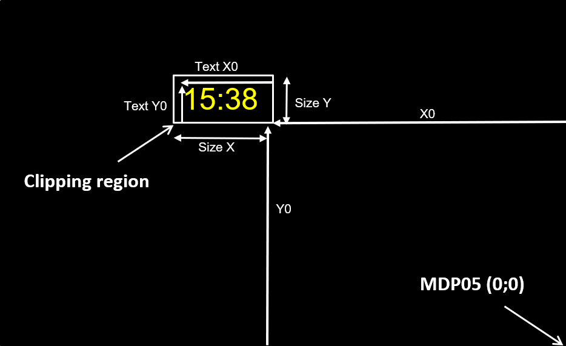

<!-- 
Date:
Owner: XB
Reviewers: BC,MW,SR,XB @ Microoled
Version: 0.0
Note: Use a markdown editor to view HTML rendering (this file was created with MacDown ).
-->

# ActiveLook® Programming Interface 

<p align="center"> 

## Introduction
The ActiveLook® solution has been designed to provide a low power head-up display user interface in glasses. The cornerstone behind the low power performance lays in the specific display and its management.

<p align="center"> 


ActiveLook® glasses typically includes:

* Glasses frame and specifically designed lenses protecting the user from wind and sunlight as well as maximizing the visual experience.
* An optical system projecting the image from the display into the user field of view.
* A low energy consumption and high brightness MICROOLED® micro display.
* An electronic module managing BLE interface and the display operation.
* A capacitive sensor.
* A gesture sensor.
* An ambiant light sensor.
* An application on an external BLE enabled device (smartphone, smartwatch, bike computer, …)  managing the information and driving the glasses.


## A Bluetooth Low Energy protocol

### BLE & GATT

The basic technologies behind the ActiveLook® display management are [Bluetooth Low Energy (BLE)](https://en.wikipedia.org/wiki/Bluetooth_Low_Energy) and [GATT](https://www.bluetooth.com/specifications/gatt).

They allow "discovery" and communication between ActiveLook® glasses (slave device), and a master BLE device. In general, you have to know about services and characteristics to communicate with a BLE device.

### Advertising
The advertising interval is set to 25 ms at start up.
 
After 30 seconds without a connection request from a master device, the advertising interval is set to 250 ms.

After 3 minutes without a connection request, the advertising is stopped and the device is turned off.


An ActiveLook® device advertises with the following data:

**Default Advertising Address**

`80 EA XX XX XX XX`, where `XX XX XX XX` is the hexadecimal serial number of the device

**Advertising Data**

The ActiveLook® device will advertise the following data : 

Device complete name, (16 characters): 

- BLE advertising data identifier = `0x09`
- First characters for Model Name (10 char max, padding with space (`0x20`) if name is shorter, then 6 characters for Customer Serial Number. Default value= A.Look    xxxxxx, where xxxxxx is the serial number of the glasses. This name can be customized with the 'set name' command. 


UIID list, suota service UUID. 

- BLE advertising data identifier = `0x02`
- value = `0xFEF5`


Manufacturer data (customer manufacturer ID and MICROOLED manufacturer ID)

- BLE advertising data identifier = `0xFF`
- Default value = `0xDAFA08F2`, where `0x08F2` is a reserved ActiveLook® value and `0xDAFA` is customer manufacturer ID


Each data is preceded by two bytes, one for length (including identifier), one for data identifier. 

Exemple: `0x` `1109412E4C6F6F4B20202020303030313238` `0302F5F2` `05FFFADA08F2`.

It is recommended to filter Bluetooth devices during discovery by manufacturer ID including `0x08F2` or `0xDAFA`


### Services and characteristics 

The following services are implemented in the BLE interface (four are standard services and two are custom for dedicated ActiveLook® commands and firmware updates).

**Generic Attribute**

UUID `0x1801`

Without characteristics

**Generic Access**

UUID `0x1800`

| Characteristic | UUID | Property | Value |
| --- | --- | --- | --- |
| Device Name | `00002A00-0000-1000-8000-00805F9B34FB` | Read | `A.LooK` |
| Appearance | `00002A01-0000-1000-8000-00805F9B34FB` | Read | UNKNOWN |
| Peripheral Preferred Connection Parameters | `00002A04-0000-1000-8000-00805F9B34FB` | Read | `0x0800100000006400` |


**Device Information Service**

UUID `0x180A`

| Characteristic | UUID | Property | Value |
| --- | --- | --- | --- |
| Manufacturer Name String | `00002A29-0000-1000-8000-00805F9B34DB` | Read | `Microoled` |
| Model Number String | `00002A24-0000-1000-8000-00805F9B34DB` | Read | `A.LooK` |
| Serial Number String | `00002A25-0000-1000-8000-00805F9B34DB` | Read | `xxxxxxxxxx`|
| Hardware version String | `00002A27-0000-1000-8000-00805F9B34DB` | Read | `rev B1`|
| Firmware version String | `00002A26-0000-1000-8000-00805F9B34DB` | Read | `3.0.0` |
| Software version String | `00002A28-0000-1000-8000-00805F9B34DB` | Read | `1.0.0.1` |

**Battery Service**

UUID `0x180F`

| Characteristic | UUID | Property | Value |
| --- | --- | --- | --- |
| Battery Level | `00002A19-0000-1000-8000-00805F9B34FB` | Read Notify | battery level (in %) |

Descriptor :	UUID `0x2902` characteristic configuration

⚠If notifications are enabled by the BLE client, the device will notify the battery level once every 30s.

**Custom Service (ActiveLook® Commands Interface)**

UUID `0x0783b03e-8535-b5a0-7140-a304d2495cb7`


| Characteristic | UUID | Property | Descriptors |
| --- | --- | --- | --- |
| TX server | `0783b03e-8535-b5a0-7140-a304d2495cb8` | Read Notify | - UUID `0x2902` configuration <br> - UUID `0x2901` description: `Server Tx Data` |
|RX server | `0783b03e-8535-b5a0-7140-a304d2495cbA` | Write, Write no response | - UUID `0x2902` configuration <br> - UUID `0x2901` description: `Server Rx Data` |
|Flow Control server | `0783b03e-8535-b5a0-7140-a304d2495cb9` | Notify | - UUID `0x2902` configuration <br> - UUID `0x2901` description : `Flow Control` |
|User interface server | `0783b03e-8535-b5a0-7140-a304d2495cbc` | Read Notify | - UUID `0x2902` configuration <br> - UUID `0x2901` description: `Server User Data`|
|Sensor interface server | `0783b03e-8535-b5a0-7140-a304d2495cbb` | Read Notify | - UUID `0x2902` configuration <br> - UUID `0x2901` description: `Server User Data`|


**Custom Service (firmware update service)**

UUID `0000FEF5-0000-1000-8000-00805F9B34FB`

(Reserved) 

## Command Interface Service

### Rx server


The custom service Rx server characteristic is used to send commands to an ActiveLook® device.

⚠ The RX server allows both Bluetooth `WRITE` (with response) and `WRITE_NO_RESPONSE` mode. It is highly recommended to use the `WRITE` (with response) mode. Depending on the master device Bluetooth stack efficiency used the (for instance on connected watches) `WRITE_NO_RESPONSE` (lower latency) can be used.

⚠ The command interface uses BINARY encoding.

⚠ All data are in big Endian (example: to encode 1024, the first byte to send is `0x04`, followed by `0x00`)


A command includes a header and a footer. The header is made of START + Command ID + Command Format + length (+ Query ID). The command layout is as follows:

**Start** : always `0xFF`

**CommandID**: command identifier 

**CommandFormat** : define the format of the command, including the number of bytes of the length (1 or 2 bytes) and the number of byte of the queryID (0 to 15 bytes)

**Length**: defines the length of the whole command header and footer included. The length can be on one or two bytes depending on the command format. The maximum length is `533` bytes with `512` bytes of data and `15` bytes of queryId.

**QueryId** (optional) : defines by user, allows to identify a query (command) and the associated response. When a query is sent with command, the response includes this query, allowing the user to match the response with the original command in an asynchronous system.

**Data** (optional) : parameters of the command

**Footer**: always `0xAA`


| 0xFF   | 0x..       | 0x0n           | 0x..        | n * 0x…   | m * 0x…        | 0xAA   |
|--------|------------|----------------|-------------|-----------|----------------|--------|
| HEADER | Command ID | Command Format | data length | Query ID  | Data           | FOOTER |
| 1B     | 1B         | 1B             | 1B          | nB        | mB             | 1B     |

| 0xFF   | 0x..       | 0x1n           | 0x.. 0x..   | n * 0x…  | m * 0x…        | 0xAA   |
|--------|------------|----------------|-------------|----------|----------------|--------|
| HEADER | Command ID | Command Format | data length | Query ID | Data           | FOOTER |
| 1B     | 1B         | 1B             | 2B          | nB       | mB             | 1B     |

⚠ A Command can be sent in multiple BLE chunks. The length and presence of footer are checked to reconstruct the whole command.


⚠ The MTU, which should be negotiated at connection, will determine the maximum number of bytes in a chunk.


### Tx server

The Tx server allows communicating from the device to the master device through notifications. 

⚠ The notifications should be enabled by the master device to be able to access this information.

The responses to the “settings” command, version command, bmpList command, fontList command, RPage command, RConfigID command are sent on the TX server.

### User data server 

The user data server is used for notifying the master device of a user interaction with the ActiveLook® device.
When the user touch the capacitive button for a short time (>3s) a notification is sent on the user data server to the master application

Capacitive button notification value: 	`1`

⚠ The notifications should be enabled by the master device to be able to access this information.

### Sensor  server

The sensor server is used for notifying the master device of user gesture detection.
When a gesture is detected on the glasses (hand motion), a notification is sent on the sensor server to the master application.

Gesture notification value: 	`1`

⚠ The notifications should be enabled by the master device to be able to access this information.

⚠ Enabling/disabling the notification on the gesture server automatically activates/deactivate the gesture sensor (gesture command not needed).

### Flow Control server

The Flow Control server provides a method to prevent the application on the Client Device from overloading the BLE memory buffer of the ActiveLook® device. The ActiveLook® device will notify the Client device when the Rx Buffer is getting full, the Client device is required to stop sending data at this time. When the Rx Buffer has been reduced to a safe level, the ActiveLook® device will notify the Client Device to re-start the flow of data. 

Flow control data is interpreted as:
| Value  | Description                                                                  |
|--------|------------------------------------------------------------------------------|
| 0x01   | master can send new data                                                     |
| 0x02   | master should stop sending data                                              |
| 0x03   | message error, the command was incomplete or corrupt, the command is ignored |
| 0x04   | Receive message queue overflow                                               |
| 0x05   | A font or bitmap message was expecting but device receive something else     |
| 0x06   | Missing the `WConfigID` command before configuration modification            |

⚠ The notifications should be enabled by the master device to be able to access this information.

⚠ Once the flow control OFF notification is sent, the subsequent commands will be ignored until the flow control ON is set.

⚠ When a message error command notification is sent after a chunk of data is received during a bitmap or font update, the subsequent chunks are not considered as bitmap or font data. The data uploading is aborted. It is recommended to erase the bitmap for which data was corrupted and resend it with the “savebmp” command.

## ActiveLook® Commands

### Glossary

`msb` : most significant byte
`lsb`: least significant byte
`r`: radius
`f`: font
`c`: color
`bpp`: bit per pixel


### General commands

| ID   | commands | parameters               | Data length (B)    | Description                                                  |
|------|----------|--------------------------|--------------------|--------------------------------------------------------------|
| 0x00 | power    | `0x00` / `0x01`          | 1                  | set the power of display and initialize display              |
| 0x01 | clear    | -                        | 0                  | Clear the display memory (black screen)                      |
| 0x02 | grey     | `0x00`..`0x0F`           | 1                  | Set the whole display memory to the corresponding grey level |
| 0x03 | demo     | -                        | 0                  | Display demonstration pattern                                |
| 0x04 | test     | `0x00` / `0x01`          | 1                  | Display the corresponding test pattern:<br>0: Fill screen<br>1: Rectangle with a cross in it |
| 0x05 | battery  | -                        | 0                  | Get the battery level                                        |
| 0x06 | vers     | -                        | 0                  | Get the device ID and firmware version                       |
| 0x07 | debug    | `0x00` / `0x01`          | 1                  | When activated return BLE data received to USB               |
| 0x08 | led      | `state`                  | 1                  | set green LED:</br>0: Off</br>1: ON</br>2: toggle</br>3: blinking |
| 0x09 | shift    | `xmsb` `xlsb` `ymsb` `ylsb` | 4               | Shift all subsequent displayed object of (x,y) pixels        |
| 0x0A | settings | -                        | 0                  | Return the user parameters used (shift, luma, sensor)        |
| 0x0B | setname  | `string`                 | 0 <= n <= 15       | Customize BLE advertising name</br>The maximum name length is 15</br>Character encoding is 'ASCII'</br>An empty name `n` = 0 will reset factory name |


### Display luminance commands

| ID   | commands | parameters         | Data length (B)    | Description                                          |
|------|----------|--------------------|--------------------|------------------------------------------------------|
| 0x10 | luma     | `0x00`..`0x0F`     | 1                  | Set the display luminance to the corresponding level |
| 0x11 | dim      | `0x00`..`0x64`     | 1                  | Reduce luminance to given percentage                 |


### Optical sensor commands:

| ID   | commands            | parameters                              | Data length (B) | Description                                                      |
|------|---------------------|-----------------------------------------|-----------------|------------------------------------------------------------------|
| 0x20 | sensor              | `0x00` / `0x01`                         | 1               | Turn on/off the auto brightness adjustment and gesture detection |
| 0x21 | gesture             | `0x00` / `0x01`                         | 1               | Turn on/off the gesture detection                                |
| 0x22 | als                 | `0x00` / `0x01`                         | 1               | Turn on/off the auto brightness adjustment                       |
| 0x23 | setSensorParameters | `mode` `als_Array (18B)`                | 19              | Set sensor parameters.<br>If mode = 0, it changes ALS array to compare when luma is changed.<br>Reboot the device is necessary |
|      |                     | `mode` `als_Period (2B)`                | 3               | If mode = 1, it changes ALS period<br>Reboot the device is necessary |
|      |                     | `mode` `ranging_Period (2B)`            | 3               | If mode = 2, it changes ranging period<br>Reboot the device is necessary |
| 0x24 | getSensorParameters | -                                       | -               | Get sensor parameters (ALS Array, ALS Period and ranging Period) |


### Graphics commands
| ID   | commands   | Parameters                                                         | Data length (B) | Description                                                              |
|------|------------|--------------------------------------------------------------------|-----------------|--------------------------------------------------------------------------|
| 0x30 | color      | `0x00`…`0x0F`                                                      | 1               | Sets the grey level used to draw the next graphical element              |
| 0x31 | point      | `x0msb` `x0lsb` `y0msb` `y0lsb`                                    | 4               | Set a pixel on at the corresponding coordinates                          |
| 0x32 | line       | `x0msb` `x0lsb` `y0msb` `y0lsb` `x1msb` `x1lsb` `y1msb` `y1lsb`    | 8               | Draw a line at the corresponding coordinates                             |
| 0x33 | rect       | `x0msb` `x0lsb` `y0msb` `y0lsb` `x1msb` `x1lsb` `y1msb` `y1lsb`    | 8               | Draw an empty rectangle at the corresponding coordinates                 |
| 0x34 | rectf      | `x0msb` `x0lsb` `y0msb` `y0lsb` `x1msb` `x1lsb` `y1msb` `y1lsb`    | 8               | Draw a full rectangle at the corresponding coordinates                   |
| 0x35 | circ       | `x0msb` `x0lsb` `y0msb` `y0lsb` `r`                                | 5               | Draw an empty circle at the corresponding coordinates                    |
| 0x36 | circf      | `x0msb` `x0lsb` `y0msb` `y0lsb` `r`                                | 5               | Draw a full circle at the corresponding coordinates                      |
| 0x37 | txt        | `x0msb` `x0lsb` `y0msb` `y0lsb` `r` `f` `c` `string`               | >= 8            | Write text `string` at coordinates(x0,y0) with rotation, font size, and color |
| 0x38 | polyline   | `x0msb` `x0lsb` `y0msb` `y0lsb` .. `xNmsb` `xNlsb` `yNmsb` `yNlsb` | (n + 1) * 4     | Draw a multiple connected lines at the corresponding coordinates         |

### Bitmaps commands

| ID   | commands                     | Parameters                                 | Data length (B)              | Description                                                              |
|------|------------------------------|--------------------------------------------|------------------------------|--------------------------------------------------------------------------|
| 0x40 | bmplist                      | -                                          | 0                            | Give the list of bitmap saved into the device                            |
| 0x41 | savebmp                      | `Size (4B)` `Width (2B)`                   | 6 bytes for the first chunk  | Save 4bpp bitmap of `size` bytes and `width` pixels                      |
| 0x42 | bitmap                       | `img_id` `xmsb` `xlsb` `ymsb` `ylsb`       | 5                            | Display image `img_id` to the corresponding coordinates                  |
| 0x43 | erasebmp                     | `img_id`                                   | 1                            | Erase all bitmaps with numbers >= `img_id`                               |
| 0x44 | Stream Bitmap                | `Size (4B)` `Width (2B)` `x (2B)` `y (2B)` | 10 bytes for the first chunk | Stream 1bpp bitmap image on display without saving it in memory          |
| 0x45 | saveBitmap (1 bit = 1 pixel) | `Size (4B)` `Width (2B)`                   | 6 bytes for the first chunk  | Save 1bpp bitmap of `size` bytes and `width` pixels                      |

### Font commands
| ID   | commands  | Parameters                                                  | Data length (byte)          | Description                                                 |
|------|-----------|-------------------------------------------------------------|-----------------------------|-------------------------------------------------------------|
| 0x50 | fontlist  | -                                                           | 0                           | Give the list of font saved into the device with their size |
| 0x51 | savefont  | `nb` `fontSize (2B)` `data (xB)` `dataSize (2B)`            | 3B for the first chunk      | Save font `nb` of `size` Bytes                              |
| 0x52 | font      | `0x00`…`0x07`                                               | 1                           | Selects font which will be used for followings txt commands |
| 0x53 | erasefont | `nb`                                                        | 1                           | Erase font from flash if present                            |

### Layout commands

| ID   | commands       | Parameters                          | Data length (byte) | Description                                             |
|------|----------------|-------------------------------------|--------------------|---------------------------------------------------------|
| 0x60 | savelayout     | `layout parameter`                  | 11                 | Save a layout (Min 17 hexadecimal parameters)           |
| 0x61 | eraselayout    | `Id`                                | 1                  | Erase corresponding layout                              |
| 0x62 | layout         | `Id` `text value`                   | 2                  | Display `text value` with layout # `Id` parameters      |
| 0x63 | clearlayout    | `Id`                                | 1                  | Clears screen of the corresponding layout area          |
| 0x65 | layoutPosition | `Id` `xmsb` `xlsb` `y`              | 4                  | Redefine the position of a layout<br/>Position is saved |
| 0x66 | layoutEx       | `Id` `xmsb` `xlsb` `y` `text value` | 5                  | Display `text value` with layout # `Id` at position `x` `y`<br/>Position is not saved |

### Gauge commands
| ID   | commands  | Parameters                                                                           | Data length (byte) | Description                                        |
|------|-----------|--------------------------------------------------------------------------------------|--------------------|----------------------------------------------------|
| 0x70 | gauge     | `nb` `value`                                                                         | 2                  | Display value (in percentage) of the gauge ([1…4]) |
| 0x71 | savegauge | `nb` `xmsb` `xlsb` `ymsb` `ylsb` `rmsb` `rLsb`<br>`r_inmsb` `r_inlsb` `start` `end` `clock wise` | 13                 | Save the parameters for the gauge `nb`             |
 
### Page commands                                                                                  
| ID   | commands   | Parameters                             | Data length (B) | Description                                  |
|------|------------|----------------------------------------|-----------------|----------------------------------------------|
| 0x80 | wpage      | `Page Parameters` `parameterSize (2B)` | >= 1            | Save parameters for a given page             |
| 0x81 | rpage      | -                                      | 0               | Reads saved parameter of a page or all pages |
| 0x82 | Erase page | `page_nb`                              | 1               | Erase a page                                 |

### Configuration and statistics commands
| ID   | commands           | Parameters                                         | Data length (B) | Description                                             |
|------|--------------------|----------------------------------------------------|-----------------|---------------------------------------------------------|
| 0xA0 | tdbg               | -                                                  | 0               | Task debugging                                          |
| 0xA1 | WConfigID          | `Config number` `Config Id (4B)` `deprecated (3B)` | 8               | Write config, Config Id is used to track which config is in the device |
| 0xA2 | RConfigID          | `Config number`                                    | 1               | Read config                                             |
| 0xA3 | SetConfigID        | `Config number`                                    | 1               | Set current config to display BMP, layout and font      |
| 0xA5 | PixelCount         | -                                                  | 0               | Get number of pixel activated on display                |
| 0xA6 | setPixelValue      | `maxPixelValue (msb1)` `maxPixelValue (msb2)` `maxPixelValue (lsb1)` `maxPixelValue (lsb2)` | 4    | Set Max Pixel Value       |
| 0xA7 | getChargingCounter | -                                                  | 0               | Get total number of charging cycle                      |
| 0xA8 | getChargingTime    | -                                                  | 0               | Get total number of charging minute                     |
| 0xA9 | getMaxPixelValue   | -                                                  | 0               | Get the maximum number of pixel activated               |
| 0xAA | resetChargingParam | -                                                  | 0               | Reset charging counter and charging time value in Param |

## ActiveLook® commands guide

### Color

The ActiveLook® OLED display is a monochrome display which has 15 different grey levels. It is designed as a memory frame buffer which retains the data while not overwritten. As each pixel has only 15 grey levels, the memory is designed with 2 pixels per byte. 
It is possible to set the grey level with the color commands. The grey level will be saved in the device and will be used to draw all subsequent graphical objects, until the color function is called again.

### Luma

Moreover, it is possible to set a global luminance setting (similar to brightness on different screens) between 15 parameters with the luma command. 

### Graphical Objects

All shapes included in the graphical commands draw objects with the grey level previously defined with the color commands. 

### Bitmaps

The graphical functions allow displaying bitmaps. 
The bitmaps must first be stored in the device with the `savebmp` command before being displayed.  
A first command defining the bitmap data length in bytes and the bitmap pixel width in pixel must be sent.
Be careful, bitmap can’t be saved if WConfigID command has not been sent before.

•	The wconfig Id command is required before any bitmap upload

•	The bitmap data is coded with 4 bits per pixel, and thus each byte defines two adjacent pixels

•	A maximum of 128 bitmaps can be stored in configuration 1, 192 in configuration 2.

•	The bitmap data is sent in chunks of maximum 512 bytes.

•	When sending bitmaps through BLE it is highly recommended to use the WRITE WITH RESPONSE Bluetooth protocol in order to make sure all data is properly saved.

The bitmap data encoding can be implemented with ActiveStudio, a Microoled software running on Windows. A text file is generated with the encoded data to send to the device.

Once stored, it is possible to display the bitmap with the bitmap command. 

At any moment it is possible to retrieve the list of the saved bitmap with the bmplist command.

### Saving Bitmap, 4 bits per pixel

The command ID `0x41` is used to save image with 4bpp.

⚠ The wconfig Id command is required before any bitmap upload

First, 4bpp image size in bytes and image width in pixels must be sent.  
If the image has an odd width, each line must be finished with a dummy pixel (4bit) included in the size.  

Example with 15 x 10 image: 

| FF       | 41         | 00         | 0B           | -        | 00000050000F                | AA     |
|----------|------------|------------|--------------|----------|-----------------------------|--------|
| Start ID | Command ID | Cmd Format | Frame length | Query ID | Data                        | End ID |

Data Parsing:

| 4bpp image size in bytes        | image width      |
|---------------------------------|------------------|
| `0x00 0x00 0x00 0x50`           | `0x00 0x0F`      |
| 80 bytes, 10 lines of 16 pixels | 15 pixels        |

<br/>

After, the image data must be sent with 4pp compression.  
Example of 4bpp compression for 5 pixels:

|      pixel number      |   1  |   2  |   3  |   4  |   5  | dummy |
|:----------------------:|:----:|:----:|:----:|:----:|:----:|:-----:|
| **pixel value (8bit)** |   0  |  32  |  64  |  128 |  255 |   NA  |
| **pixel value (4bit)** |   0  |   2  |   4  |   8  |  15  |   NA  |
|        **bytes**       | <span style="color:blue">0xX0</span> | <span style="color:blue">0x2X</span> | <span style="color:green">0xX4</span> | <span style="color:green">0x8X</span> | <span style="color:red">0xXF |  <span style="color:red">0x0X</span> |
|        **frame**       | 0x20 |      | 0x84 |      | 0x0F |

Example of compression loop in python:
``` python
## compress img into 4bpp
frame = []
for i in range(height):
	byte = 0
	shift = 0
	for j in range(width):
		## convert 8bpp to 4bpp
		pxl = round(gray[i,j] / 17)

		## compress 4bpp
		byte += pxl << shift
		shift += 4
		if shift == 8:
			frame.append(byte)
			byte = 0
			shift = 0
	if shift != 0:
		frame.append(byte)
```

<br/>

Data are sent in chunk of 512 bytes with command Id `0x41`  
Example for a 15 x 10 image:  
``` python
## write config 1
0xFFA1000D0100000000000000AA
## save image, 80 bytes, 15 pixel width
0xFF41000B00000050000FAA
## image data, 10 lines of 8 bytes
0xFF410055113243557688A90A213244657798A90B214354668798BA0B3243557688A9BA0C3244657798A9BB0C4354668798BACB0D43657688A9BACC0D44657798A9BBDC0E54668798BACBDD0E657688A9BACCED0EAA
```

### Saving Bitmap, 1 bits per pixel

To reduce image transfer time, images can also be sent with 1bpp compression via command Id `0x45`.  

⚠ The wconfig Id command is required before any bitmap upload

First, 1bpp image size in bytes and image width in pixels must be sent.  
If the image width is not a multiple of 8, each line must be finished with dummies pixels included in the size.  

Example with 15 x 10 image: 

| FF       | 45         | 00         | 0B           | -        | 00000014000F                | AA     |
|----------|------------|------------|--------------|----------|-----------------------------|--------|
| Start ID | Command ID | Cmd Format | Frame length | Query ID | Data                        | End ID |

Data Parsing:

| 1bpp image size in bytes        | image width      |
|---------------------------------|------------------|
| `0x00 0x00 0x00 0x14`           | `0x00 0x0F`      |
| 20 bytes, 10 lines of 16 pixels | 15 pixels        |

<br/>

After, the image data must be sent with 1pp compression.  
Example of 1bpp compression for 5 pixels:

|      pixel number      |      1     |      2     |      3     |      4     |      5     |    dummies |
|:----------------------:|:----------:|:----------:|:----------:|:----------:|:----------:|:----------:|
| **pixel value (8bit)** |      0     |     32     |     64     |     128    |     255    |     NA     |
| **pixel value (1bit)** |      0     |      1     |      1     |      1     |      1     |     NA     |
|        **byte**        | 0bXXXXXXX0 | 0bXXXXXX1X | 0bXXXXX1XX | 0bXXXX1XXX | 0bXXX1XXXX | 0b000XXXXX |
|        **frame**       | 0x1E     


Example of compression loop in python:
``` python
## compress img 1 bit per pixel
frame = []
for i in range(height):
	byte = 0
	shift = 0
	line = []
	for j in range(width):
		## convert gray8bit in gray1bit
		if (gray[i,j] > 0):
			pxl = 1
		else:
			pxl = 0

		## compress 1bpp
		byte += pxl << shift
		shift += 1
		if shift == 8:
			line.append(byte)
			byte = 0
			shift = 0
	if shift != 0:
		line.append(byte)
	frame.append(line)
```

<br/>

Data are sent in chunk of 512 bytes with command Id `0x45`  
A line can't be truncate between two chunks. Each chunk must contain only complete lines.  

Example for a 15 x 10 image:  
``` python
## write config 1
0xFFA1000D0100000000000000AA
## save image, 20 bytes, 15 pixel width
0xFF45000B00000014000FAA
## image data, 10 lines of 2 bytes
0xFF450019C001300608080410022001400140814062211C1EAA
```

### Streaming Bitmap

It is also possible to stream images on display without saving them in memory with command Id `0x44`. 
This method is based on the same principle used to save bitmaps with 1 bit per pixel (a method with 4 bit per pixel would require transferring too much data).  

First, 1bpp image size in bytes, image width in pixels, x/y coordinate must be sent.  
If the image width is not a multiple of 8, each line must be finished with dummy pixels included in the size.  

Example with 15 x 10 image: 

| FF       | 44         | 00         | 0F           | -        | 00000014000F00320050        | AA     |
|----------|------------|------------|--------------|----------|-----------------------------|--------|
| Start ID | Command ID | Cmd Format | Frame length | Query ID | Data                        | End ID |

Data Parsing:

| 1bpp image size in bytes        | image width      | x           | y           |
|---------------------------------|------------------|-------------|-------------|
| `0x00 0x00 0x00 0x14`           | `0x00 0x0F`      | `0x00 0x32` | `0x00 0x50` |
| 20 bytes, 10 lines of 16 pixels | 15 pixels        | x = 50      | y = 80      |

<br/>

Data are sent in chunk of 512 bytes with command Id `0x44`  
A line can't be truncate between two chunks. Each chunk must contain only complete lines. 

For example, a 15x10 bitmap can be done as follows :
``` python
## 20 bytes, 15 pixel width, x = 50, y = 80
0xFF44000F00000014000F00320050AA
## image data, 10 lines of 2 bytes
0xFF440019C001300608080410022001400140814062211C1EAA
```

### Coordinates

The coordinates passed as parameters (x0,y0) and (x1,y1) define the extremities of the element to be drawn. These coordinates are defined as signed integers on 16 bits (2 bytes), and thus can be negative. In that case the drawn object will be automatically clipped to the screen size (304; 256). 
The same principle applies to the bitmap.

Here is an example of bitmap clipping with x0, y0 as negative values. 

<p align="center">

Example: `0xFF 0x42 0x00 0x0A 0x0A 0xFF 0xC0 0xFF 0xC0 0xAA` display bitmap #10 at (-64;-64).

### Text

The graphical commands allow drawing text with different font size and orientation. 
The text command uses the same coordinate principle as the graphical elements commands. 
The text data are given as ASCII characters.
The rotation of the text depending on the text orientation parameter is illustrated below. The red dot symbolizes the text coordinates for each orientation.


<p align="center">


Example:
 
-	`0xFF 0x37 0x00 0x1B`  `0x00 0x98 0x00 0x8`  `0x04`  `0x02` `0x0F` `0x68 0x65 0x6C 0x6C 0x6F 0x20 0x3`  `0xAA`

display text `hello 4` at (152;128) (center of the screen) with direction 4, the font 2 and the color 15. 

-	`0xFF 0x37 0x00 0x1B` `0x00 0x98 0x00 0x80` `0x0`  `0x02`  `0x0F`  `0x68 0x65 0x6C 0x6C 0x6F 0x20 0x30`  `0xAA`

display text `hello 0` at (152;128) (center of the screen) with direction 0, the font 2 and the color 15. 


<p align="center">

### Shift

In order to adapt mechanical or optical constraints after system mounting, it is possible to move the displayed objects on screen using the shift command.
After setting image shift, all subsequent graphical elements will be displayed with this shift (layout included). The shift parameters are saved in the device and are applied automatically even after power off and restart.
The shift command does NOT change the graphical elements already present on display. In order to apply the shifted display, it is recommended to clear the screen, and then draw new elements on display.

### Font 

The text is displayed using encoded fonts. A font is selected with the “txt” command or font command.
By default, 3 fonts are stored in the device. The size of these fonts is 24, 36 and 48 in the respective font space 1,2 and 3.
Fonts can be uploaded in the device using the “savefont” command.
Be careful, fonts can’t be saved if WConfigID command has not been sent.


⚠
•	Up to 8 fonts can be saved. 
•	It is not recommended to useful font bigger than 48, bigger size fonts containing only the desired characters are recommended.s
•	The fonts use ASCII char encoding : http://www.asciitable.com/
•	Up to 125 chars can be present in a font.
•	Font display text in black and white, no grey level
•	A char maximum saving space is 256 bytes
•	A font maximum saving space is 8192 bytes
•	If a character is not defined in a font, it is replaced by space.

In order to save a font the font data must be encoded, as below :

|     Addr     | size(B) |       content       |                                comments                                |
|:------------:|:----------:|:-------------------:|:----------------------------------------------------------------------:|
|       0      |      1     | `0x01`            | reserved                                                               |
|       1      |      1     | font height         | in pixel                                                               |
|       2      |      2     | first char in font  | ascii number of the first  char present in the font(usually 32: space) |
|       4      |      2     | last chat in font   | ascii number of the last char present in font (usually 126 :~)         |
|  `0x06`..`0xFF`  |   125 x2   | char offset table   | tables of 16 bits address offsets in the font data for each character  |
| `0x100`…`0x1FFF` |    7936    | font data           | RLE encoded chars                                                      |

The first byte is always 0x01 and the second defines the font height in pixels.

A font can contain only a part of the available characters of the ASCII table, in order to save space and upload time. For instance a font can contain only the numbers, thus ASCII characters from 48 to 57 (0..9).
In that case the first char is 0x30 (48) and the last 0x39 (57). 

The char offset table contains the addresses of the data defining each character taking into account the first and last chars. For instance, if we consider a font containing all displayable basic ascii characters, space (32) to ‘~’(126).  
The character ‘a’ is ASCII 97. 
In the offset table we retrieve two bytes at the address:
(97-32)x2+6 and (97-32)x2+6 +1 , thus 136 and 137 bytes of the offset table. 
These bytes (MSB first) gives the 16 bits address data for ‘a’ in the font data table.

The data in font table is encoded as below, for each char

|   addr   |              |                                                                      Content                                                                      |
|:--------:|:------------:|:-------------------------------------------------------------------------------------------------------------------------------------------------:|
|     0    |              | length of char in bytes(number of bytes used to defined this char)                                                                                |
|     1    |              | width of char in pixels                                                                                                                           |
| 2…length |       n      | [7:0]= 0x00 => RLE encoding else  [7:4]= number of off pixels / [3:0] = number of on pixels                                                       |
|          | n+1 (if n=0) | RLE encoding : [7] = 1 => on pixels / [6:0] => number of repeated on pixels x 8 [7] = 0 => off pixels/ [6:0] => number of repeated off pixels x 8 |

The first byte defines the number of bytes following defining the char. 
The second byte defines the width in pixels of each line of the char.
Then follow length -2 bytes defining the char pixels. The pixel of a char can be on (white) or off (black). 
If the n byte is different from 0, it defines a sequence of off pixels and on pixels, fifteen pixels maximum for each. 
If the n byte is equal to 0, the n+1 byte defines a sequence of on pixels or off pixels depending on the value of the MSB, with a length of a minimum of 8 pixels and up to 1016 pixels.

⚠When sending fonts through BLE, using the flow control interface is highly recommended, in order to ensure all data is properly saved . Then the bitmap data is sent in chunks of maximum 128 characters.


Example:
Syntax of “savefont” command, saving the font 4 in memory, of size 430 and containing char definition for only the numbers (0…9) and space.

	1st chunk:	0xFF 0x51 0x00 0x08 0x04 0x01 0xAE 0xAA
	2nd chunk: 	0xFF 0x51 0x00 0x2B 0x01 0x0E 0x00 0x30 0x00 0x39 0x00 0x00 0x00 0x15 0x00 0x24 0x00 0x33 0x00 0x43 0x00 0x54 0x00 0x64 0x00 0x78 0x00 0x86 0x00 0x9A 0x00 0xAE 0x00 0x00 0x00 0x00 0x00 0x00 0x00 0x00 0x00 0x00 0xAA
	3rd chunk:	0xFF 0x51 0x00 0x2B 0x00 0x00 0x00 0x00 0x00 0x00 0x00 0x00 0x00 0x00 0x00 0x00 0x00 0x00 0x00 0x00 0x00 0x00 0x00 0x00 0x00 0x00 0x00 0x00 0x00 0x00 0x00 0x00 0x00 0x00 0x00 0x00 0x00 0x00 0x00 0x00 0x00 0x00 0xAA
	4th chunk: 	0xFF 0x51 0x00 0x2B 0x00 0x00 0x00 0x00 0x00 0x00 0x00 0x00 0x00 0x00 0x00 0x00 0x00 0x00 0x00 0x00 0x00 0x00 0x00 0x00 0x00 0x00 0x00 0x00 0x00 0x00 0x00 0x00 0x00 0x00 0x00 0x00 0x00 0x00 0x00 0x00 0x00 0x00 0xAA
	5th chunk:	0xFF 0x51 0x00 0x2B 0x00 0x00 0x00 0x00 0x00 0x00 0x00 0x00 0x00 0x00 0x00 0x00 0x00 0x00 0x00 0x00 0x00 0x00 0x00 0x00 0x00 0x00 0x00 0x00 0x00 0x00 0x00 0x00 0x00 0x00 0x00 0x00 0x00 0x00 0x00 0x00 0x00 0x00 0xAA
	6th chunk:	0xFF 0x51 0x00 0x2B 0x00 0x00 0x00 0x00 0x00 0x00 0x00 0x00 0x00 0x00 0x00 0x00 0x00 0x00 0x00 0x00 0x00 0x00 0x00 0x00 0x00 0x00 0x00 0x00 0x00 0x00 0x00 0x00 0x00 0x00 0x00 0x00 0x00 0x00 0x00 0x00 0x00 0x00 0xAA
	7th chunk:	0xFF 0x51 0x00 0x2B 0x00 0x00 0x00 0x00 0x00 0x00 0x00 0x00 0x00 0x00 0x00 0x00 0x00 0x00 0x00 0x00 0x00 0x00 0x00 0x00 0x00 0x00 0x00 0x00 0x00 0x00 0x00 0x00 0x00 0x00 0x00 0x00 0x00 0x00 0x00 0x00 0x00 0x00 0xAA
	8th chunk:	0xFF 0x51 0x00 0x2B 0x00 0x00 0x00 0x00 0x00 0x00 0x00 0x00 0x00 0x00 0x00 0x00 0x00 0x00 0x00 0x00 0x00 0x00 0x00 0x00 0x00 0x00 0x00 0x00 0x00 0x00 0x00 0x00 0x15 0x07 0xF0 0x83 0x31 0x31 0x21 0x31 0x21 0x31 0xAA
	9th chunk:	0xFF 0x51 0x00 0x2B 0x21 0x31 0x21 0x31 0x21 0x31 0x21 0x31 0x33 0xF0 0x80 0x0F 0x07 0xF0 0x91 0x52 0x41 0x11 0x61 0x61 0x61 0x61 0x61 0x61 0xF0 0x90 0x0F 0x07 0xF0 0x83 0x31 0x31 0x61 0x61 0x51 0x61 0x51 0x51 0xAA
	10th chunk:	0xFF 0x51 0x00 0x2B 0x55 0xF0 0x70 0x10 0x07 0xF0 0x83 0x31 0x31 0x61 0x61 0x42 0x71 0x61 0x21 0x31 0x33 0xF0 0x80 0x11 0x07 0xF0 0xA1 0x52 0x52 0x41 0x11 0x41 0x11 0x31 0x21 0x35 0x51 0x61 0xF0 0x80 0x10 0x07 0xAA
	11th chunk:	0xFF 0x51 0x00 0x2B 0xF0 0x84 0x31 0x51 0x64 0x31 0x31 0x61 0x61 0x21 0x31 0x33 0xF0 0x80 0x14 0x07 0xF0 0x83 0x31 0x31 0x21 0x61 0x12 0x32 0x21 0x21 0x31 0x21 0x31 0x21 0x31 0x33 0xF0 0x80 0x0E 0x07 0xF0 0x75 0xAA
	12th chunk:	0xFF 0x51 0x00 0x2B 0x51 0x61 0x51 0x61 0x61 0x51 0x61 0x61 0xF0 0xA0 0x14 0x07 0xF0 0x83 0x31 0x31 0x21 0x31 0x21 0x31 0x33 0x31 0x31 0x21 0x31 0x21 0x31 0x33 0xF0 0x80 0x14 0x07 0xF0 0x83 0x31 0x31 0x21 0x31 0xAA
	13th chunk: 0xFF 0x51 0x00 0x11 0x21 0x31 0x21 0x22 0x32 0x11 0x61 0x21 0x31 0x33 0xF0 0x80 0xAA

	
The “fontlist” command allows retrieving a list of the fonts saved in the device and their respective size.
The “erasefont” command allows erasing a user updated font. 
The fonts 1,2 and 3 are defined in the ActiveLook® device by default. The User can update them. If the user erases one of these fonts, the default one is used instead.

### Layout

In order to simplify the use of graphical elements, it is possible to save a list of graphical commands in layouts. These layouts are identified by a simple number and allow displaying a value (passed as function argument) as text or displaying another graphical element (bitmap, circle…).

A number of layout IDs are predefined to match a particular type of event or type of information received. 
Be careful, layout can’t be saved if WConfigID command has not been sent.

**Event layout**

If the layout data are stored in flash memory, they will be automatically displayed when the corresponding event occurs.

| Layout # | Name               | Description                                                   |
|----------|--------------------|---------------------------------------------------------------|
|     0    | Device boot        | Booting screen displayed for 5 s                              |
|     1    | -                  | Reserved                                                      |
|     2    | Connection request | Screen when no BLE or USB connection to the device after boot |
|     3    | Connected          | Connection established screen                                 |
|     4    | Connection lost    | Screen following BLE disconnection                            |
|     5    | Shut Down          | Message displayed before shut down.                           |
|     6    | -                  | reserved                                                      |
|     7    | Battery level      | Screen used to display battery level                          |
|     8    | -                  | Reserved                                                      |
|     9    | Firmware update    | Firmware update ongoing screen                                |

The system layouts are predefined and stored in the device, these layouts can be modified or erased.

**Information Layout**

Similarly, for different types of data a number of layout Id are predefined in the device. These layouts will be displayed when the corresponding command is received. They are numbered from 10 to 59. An argument can be passed to the layout to be displayed.


**Layout parameters**

A layout is encoded with 17 to 128 bytes. 
- The first parameter is  the clipping region (rectangle on the display in which the layout is defined), the clipping region is defined by the coordinate of the upper top corner and the size of the region (xsize,Ysize).
- The parameters also include the fore color and back color of the graphical object. 
- If the layout argument is displayed using text, its font, color, rotation, opacity and position are defined. 
- Then it is possible to define additional graphical commands to be displayed.

Here are layout data definitions:

| Byte offset |   Parameter   | Comments                                                                                   |
|-------------|:-------------:|--------------------------------------------------------------------------------------------|
|      0      |       Id      | Layout number                                                                              |
|      1      |      size     | Size of the additional command in bytes                                                    |
|      2      |       X0      | Upper left Clipping region coordinate in the display (2 bytes)                             |
|      4      |       Y0      | Upper left Clipping region coordinate in the display                                       |
|      5      |     size X    | Size X of the Clipping region in the display (2 bytes)                                     |
|      7      |     size Y    | Size Y of the Clipping region in the display                                               |
|      8      |   ForeColor   | Define the color of the region [0…15]                                                      |
|      9      |   BackColor   | Define the back color of the region [0…15]                                                 |
|      10     |      Font     | Define the font of the region                                                              |
|      11     |   TextValid   | Define if the argument of the layout is displayed using text                               |
|      12     |    Text X0    | Define the position in the layout clipping region of the argument in the display (2 bytes) |
|      14     |    Text Y0    | Define the position in the layout clipping region of the argument in the display           |
|      15     | Text Rotation | Define the argument rotation                                                               |
|      16     |  Text opacity | Define the argument opacity(on/off)                                                        |
|    17…127   |    Commands   | Additional graphical commands                                                              |

If additional graphical commands are needed, the size in terms of bytes of these commands is stored in the size parameter. The additional commands are identified as below, followed with the command parameters, 
The element positions are all referenced from the layout clipping region (X0, Y0)  :

| Command | Id | Parameter length (B)     |                  Parameters bytes                 |
|:-------:|----|:------------------------:|:-------------------------------------------------:|
|  bitmap |  0 |             5            |           bmpNb x0Msb x0lsb y0msb y0lsb           |
|   circ  |  1 |             6            |         x0Msb x0lsb y0msb y0lsb Rmsb Rlsb         |
|  circf  |  2 |             6            |         x0Msb x0lsb y0msb y0lsb Rmsb Rlsb         |
|  color  |  3 |             1            |                       Color                       |
|   font  |  4 |             1            |                        Font                       |
|   line  |  5 |             8            |  x0Msb x0lsb y0msb y0lsb x1Msb x1lsb y1msb y1lsb  |
|  point  |  6 |             2            |              x0Msb x0lsb y0msb y0lsb              |
|   rect  |  7 |             8            |  x0Msb x0lsb y0msb y0lsb x1Msb x1lsb y1msb y1lsb  |
|  rectf  |  8 |             8            |  x0Msb x0lsb y0msb y0lsb x1Msb x1lsb y1msb y1lsb  |
|   text  |  9 |            6…            | x0Msb x0lsb y0msb y0lsb lengthofstr string(ASCII) |
|  gauge  | 10 |            1             |                    Gauge number                   |

⚠  If the layout use a gauge, the gauge value will come from the text provided in the layout command (0x62)

If graphical elements of a layout are outside the clipping area, they will be cropped and they won’t be displayed on screen.


<p align="center">

### Layout Position
A layout is defined by its clipping region position, as well as all by the elements that are part of it. 
It is possible to redefine the position of a layout. All the graphical element included in the layout will be shifted accordingly (in the limit of the screen boundary).

In order to do so, the layout position command (`0x65`) must be used.

⚠When redefining a layout position take into account the layout orientation. The layout position is ALWAYS referenced to display (0;0). 

	Example : 
	0xFF6500090A001E19AA
	Reposition layout #10 : 0xFF6500090A001E19AA
	At X = 200 and Y = 200 : 0xFF6500090A00C8C8AA

<p align="center">

In order to save a new layout, the command savelayout must be sent followed by the layout parameters in hexadecimal 


	Example 1 
	
	“0xFF6000160A00001ECD0097E60F000101006EE30401AA”
	
	Saves layout #10 
	“0xFF6000160A00001ECD0097E60F000101006EE30401AA”
	with no additional command 
	“0xFF6000160A00001ECD0097E60F000101006EE30401AA”
	
	with the clipping region (0;0)/(303;255), 
	“0xFF6000160A00001ECD0097E60F000101006EE30401AA”
	
	forecolor 15, back color 0, font 1, 
	“0xFF6000160A00001ECD0097E60F000101006EE30401AA”
	
	display the argument value as text at (EE,30) with direction 4 and opacity on 
	“0xFF6000160A00001ECD0097E60F000101006EE30401AA”

In order to display a layout, the layout command must be sent, followed by the layout number and layout argument ex “0xFF62000B0A31353A3338AA ” (layout 10 used as time by default)

<p align="center">

	Exemple 2 
	
	FF6000280D12001E550112910F00030100C3860401000200D1005604010900610072044B4D2F48AA
	       
	
	Saves layout #13, with 18 bytes of additional command, FF6000280D12001E550112910F00030100C3860401000200D1005604010900610072044B4D2F48AA
	
	with clipping region X0, Y0 (75,100) and size(120,117), 
	0D120000000078750F00030100ADBC040004010004004B00640900A3008F044B4D2F48
	
	forecolor 15, backcolor 0, font 3,
	0D12004B6400C3D90F00030100ADBC040004010004004B00640900A3008F044B4D2F48
	
	display input value as text at (98,88) with direction 4 and opacity off,
	0D12004B6400C3D90F000301006258040004010004004B00640900A3008F044B4D2F48
	
	changes font to 1
	0D12004B6400C3D90F00030100ADBC040004010004004B00640900A3008F044B4D2F48
	
	display bitmap #4 at (00,00)
	0D12004B6400C3D90F00030100ADBC040004010004000000000900A3008F044B4D2F48
	
	display text at (88,043), 4 characters “KM/H” 
	0D12004B6400C3D90F00030100ADBC040004010004004B0064090058002B044B4D2F48

In order to display a layout, the layout command must be sent, followed by the layout number and layout argument (ex `0xFF62000B0D31322E35AA`) (speed 12.5 km/h if layout is saved in the device)

<p align="center">


It is possible to erase the layout with the “eraselayout” command followed by the layout number

It is possible to clear the screen of the corresponding layout area with the “clearlayout” command.
Exemple : `0xFF 0x63 0x00 0x06 0x0D 0xAA`

### Default profile

A set of layout of predefined layouts is present in the ActiveLook® device by default, these layouts use a set of default bitmap and font and are used by the ActiveLook® smart application to display information. This profile can be modified or updated  by the user.

| Layout # | Name                |                                            command                                             |
|----------|---------------------|:----------------------------------------------------------------------------------------------:|
|    10    | time                | `0x0A000008E8004BFF0F0001010046FE0401`                                                         |
|    11    | chrono              | `0x0B06001E910112CD0F00030100C8C50401000100D10093`                                             |
|    12    | Distance            | `0x0C10001E550112910F00030100C3860401000400D10056040109005C0072024B4D`                         |
|    13    | Speed               | `0x0D12001E550112910F00030100C3860401000200D1005604010900610072044B4D2F48`                     |
|    14    | Average speed       | `0x0E12001E190112550F00030100C34D0401000300D1001B04010900610039044B4D2F48`                     |
|    15    | Running cadence     | `0x0F1C001E190112550F00030100C34D0401000600D1001B040109005C004E044D494E2F040109005C0039024B4D` |
|    19    | Ascending elevation | `0x130F001E190112550F00030100C34D0401000500D1001B040109005C0039014D`                           |
|    21    | Heart rate          | `0x1511001E550112910F00030100C3860401000700D10056040109005C00720342504D`                       |

Resulting in the following info displayed in the glasses: 

<p align="center">

### Gauge

There are up to 4 gauges that can be saved, starting from 1 to 4.
A gauge allows to graphically represent a percentage value using circle portions, 16 portions in a full circle and color gradient. 


A gauge is defined by a set of parameters: 

* Gauge number to identify the gauge
* Coordinates of the center of the gauge
* External and internal radius of the gauge
* First and last circle portions of the gauge
* Gauge orientation clockwise or counter clockwise

<p align="center">

These parameters are set using the “savegauge” commands, the circle portions are automatically calculated and referenced as below, allowing selection of the first and last portion of the gauge:

<p align="center">

Once the gauge parameters are set and saved. It is possible to display the gauge using the “gauge” command. Depending on the percentage value given to the command the gauge will automatically be set. 

<p align="center">

Example:

Save gauge: `0xFF710011010097007F006E004B030E01AA`

Frame parsing: 

| FF       | 71         | 00         | 11           | -        | 010097007F006E004B030E01    | AA     |
|----------|------------|------------|--------------|----------|-----------------------------|--------|
| Start ID | Command ID | Cmd Format | Frame length | Query ID | Data                        | End ID |

Data Parsing:

| Gauge number (1) | x (151)     |  y (127)    | rExt (110)  | rIn (75)    | first portion (3) | last portion (14) | clockwise |
|------------------|-------------|-------------|-------------|-------------|--------------------|------------------|-----------|
|`0x01`            | `0x00 0x97` | `0x00 0x7F` | `0x00 0x6E` | `0x00 0x4B` | `0x03`             | `0x0E`           | `0x01`    |

The frame will save gauge 1, in the middle of the screen (x=151, y=127), of external radius 110 pixels, and internal radius 75, start segment 3, end segment 14, clockwise.

Display Gauge 1, 85%: `0xFF7000070155AA`

| FF       | 70         | 00         | 07           | -        | 0155         | AA     |
|----------|------------|------------|--------------|----------|--------------|--------|
| Start ID | Command ID | Cmd Format | Frame length | Query ID | Gauge 1, 85% | End ID |


Once its parameters defined, a gauge can be included in a layout as an additional command, allowing to display the value in the center.

Save Layout: `0xFF63001F1409000000012FE60F00020100AF8704010A0109007800870125AA`

Frame parsing: 

| FF       | 63         | 00         | 1F           | -        | 1409000000012FE60F00020100AF8704010A0109006C00870125 | AA     |
|----------|------------|------------|--------------|----------|------------------------------------------------------|--------|
| Start ID | Command ID | Cmd Format | Frame length | Query ID | Data                                                 | End ID |

Data Parsing:

| Layout Id (20) | additional command length (9) |  x (0)      | y (0)  | x size (303) | y size (230) | fore color (15)  | back color (0) | font (2) | use text (True) | text x (175) | text y (135) | text rotation (4) | text opacity (1) | additional command     |
|----------------|-------------------------------|-------------|--------|--------------|--------------|------------------|----------------|----------|-----------------|--------------|--------------|-------------------|------------------|------------------------|
| `0x14`         | `0x09`                        | `0x00 0x00` | `0x00` | `0x01 0x2F`  | `0xE6`       | `0x0F`           | `0x00`         | `0x02`   | `0x01`          | `0x00 0xAF`  | `0x87`       | `0x04`            | `0x01`           | `0x0A0109006C00870125` |

Additional command Parsing:
| command (gauge) | gauge number (1) | command (text) | text x (108) | text y (135) | text length (1) | text ('%') |
|-----------------|------------------|----------------|--------------|--------------|-----------------|------------|
| `0x0A`          | `0x01`           | `0x09`         | `0x00 0x6C`  | `0x00 0x87`  | `0x01`          |  `0x25`    |

Here is the result with the command

Display layout: `0xFF62000914835500AA`

Frame parsing: 
| FF       | 62         | 00         | 09           | -        | 14383500            | AA     |
|----------|------------|------------|--------------|----------|---------------------|--------|
| Start ID | Command ID | Cmd Format | Frame length | Query ID | id (20) text ('85') | End ID |


<p align="center">

### Page

Pages are defined as a set of layouts to be displayed together on the screen. Usually a layout is used to display a certain type of information, for instance, the speed or the time. Depending on the application and on user settings different layouts can be displayed in a page. 

The page commands allow saving user settings in the device and to retrieve them for the application. 

A page is defined by its number (0…15), its orientation (same orientation as text see §text) and the layouts to be displayed in this page. 

<p align="center">

In order to save page settings or retrieve page settings, the “wpage” and “rpage” commands must be used. 

Examples: 

-	Wpage : `0xFF 0x80 0x00 0x09 0x00 0x04 0x0C 0x13 0xAA` 

will save the page 0 :
`0xFF 0x80 0x00 0x09 0x00 0x04 0x0C 0x13 0xAA`

which text orientation is 4 :
`0xFF 0x80 0x00 0x09 0x00 0x04 0x0C 0x13 0xAA`

and includes the layout 12 and 19 :
`0xFF 0x80 0x00 0x09 0x00 0x04 0x0C 0x13 0xAA`


-	rpage : `0xFF 0x81 0x00 0x05 0xAA`
command will return a string for each page saved in the device as below :

Response :
`0x00040C13` : page 0, orientation 4, layout 12 and 19
`0x01040A10` : page 1, orientation 4, laoyout 10 and 16 

-	Erase page
`0xFF 0x82 0x00 0x06 0x61 0xAA` will erase all pages, the “rpage” won’t return the saved pages anymore
`0xFF 0x82 0x00 0x06 0x01 0xAA` will erase the page 1 data, the “rpage” 


## Notifications

### Battery Level

Command to send : `0xFF05040911223344AA`

Response : `0xFF05040A1122334464AA`

Frame parsing: 

| FF       | 05         | 04         | 0A           | 11223344 | 64                          | AA     |
|----------|------------|------------|--------------|----------|-----------------------------|--------|
| Start ID | Command ID | Cmd Format | Frame length | Query ID | Battery level (0x64 = 100%) | End ID |

### Version

Command to send : `0xFF06040911223344AA` 

Response : `0xFF0604121122334403050062120B000002AA`

Frame parsing: 

| FF       | 06         | 04         | 12           | 11223344 | 03050062120B000002 | AA     |
|----------|------------|------------|--------------|----------|--------------------|--------|
| Start ID | Command ID | Cmd Format | Frame length | Query ID | data               | End ID |

Data Parsing:

| Firmware version (3.5.0b) | Year/Week |     Number     |
|---------------------------|-----------|----------------|
|`0x03 0x05 0x00 0x62`      | `0x12 0x0B` | `0x00 0x00 0x02` |

### GetSensorParameters

Command to send : `0xFF240005AA` 

Response : `0xFF24001B003200FA03E80BB81770232827102EE03A9800640014AA`

Frame parsing: 

| FF       | 24         | 00         | 1B           | -        | 003200FA03E80BB81770232827102EE03A9800640014 | AA     |
|----------|------------|------------|--------------|----------|----------------------------------------------|--------|
| Start ID | Command ID | Cmd Format | Frame length | Query ID | data                                         | End ID |

Data Parsing:

| AlsLum[0] (50) | AlsLum[1] (250) | AlsLum[2] (1000) | AlsLum[3] (3000) | AlsLum[4] (6000) | AlsLum[5] (9000) | AlsLum[6] (10000) | AlsLum[7] (12000) | AlsLum[38 (15000) | Als Period (100) | Range Period (20) |
|----------------|-----------------|------------------|------------------|------------------|------------------|-------------------|-------------------|-------------------|------------------|-------------------|
| `0x00 0x32`    | `0x00 0xFA`     | `0x03 0xE8`      | `0x0B 0xB8`      | `0x17 0x70`      | `0x23 0x28`      | `0x27 0x10`       | `0x2E 0xE0`       | `0x3A 0x98`       |   `0x00 0x64`    |  `0x00 0x14`      | 

### Rpage

Command to send : `0xFF81000911223344AA` 

Response : `0xFF81041D00040B0D0E00FF01040B0C1300FF02040B150FF00AA`

Frame parsing: 

| FF       | 81         | 04         | 1D           | 11223344 | 00040B0D0E00FF01040B0C1300FF02040B150FF00 | AA     |
|----------|------------|------------|--------------|----------|-------------------------------------------|--------|
| Start ID | Command ID | Cmd Format | Frame length | Query ID | 1rst part of the data                      | End ID |

### Settings

Command parameters : settings `query ID`

Command to send : `0xFF0A040911223344AA` 

Response :`0xFF0A0412233440E0000070101AA`

Frame parsing :

| FF       | 0A          | 04         | 0E           | 11223344 | 0000070101 | AA     |
|----------|-------------|------------|--------------|----------|------------|--------|
| Start ID | Commande ID | Cmd Format | Frame Length | Query ID | Data       | End ID |

Data parsing:

| 00                                             | 00                                             | 07                                  | 01                        | 01                            | 0000070101 | AA     |
|------------------------------------------------|------------------------------------------------|-------------------------------------|---------------------------|-------------------------------|------------|--------|
| Shift of 0 pixels in X (signed : -128 to +127) | Shift of 0 pixels in Y (signed : -128 to +127) |  « luma » value set  to 7 (0 to 15) | Als enable (0 to disable) | Gesture enable (0 to disable) | Data       | End ID |

### Bmplist

The bitmaps are always returned in the growing order, from 0 to 95. The bitmaps are only returned if they  exist. 

There cannot be a « free » space between 2 bitmaps. If a bitmap N is present, then all the bitmaps from 0 to N-1 exist and are present in the memory.

Command to send = bmplist `query ID`

Example :

Command to send : `0xFF40040911223344AA`

Response : `0xFF40042D11223344003c003c000e001e000e` | [..] | `003c003c003c003c003caaaaaa`

Note : in this example, the command returns all 96 bitmaps. For clarity, only the first and last frames are kept and explained.

1rst frame format :

| FF       | 40          | 04         | 11223344  | 2D           | 0000070101 | AA     |
|----------|-------------|------------|-----------|--------------|------------|--------|
| Start ID | Commande ID | Cmd Format | Query ID  | Frame length | Data       | End ID |

[...]

Last frame:

| 003c003c003c003c003c | AA     |
|----------------------|--------|
| data                 | End Id |

The length data for 1 bitmap is fixed, so there is no separation bytes between 2 bitmaps. The 2 first bytes are for the bitmap length (in pixels) and the following 2 are for the width (in pixels).

Parsing example for the 1rs bitmap :

| 003c                     | 003c                    |
|--------------------------|-------------------------|
| Bitmap length (in pixel) | Bitmap width (in pixel) |


**Layout format**

This part describes the format for a generic layout.

A layout is made of 2 parts : one of a fixed size (also named « fixed part ») and one with a variable size (also named « variable part).

The fixed part includes the « clipping region » as well as the necessary information to display the argument of the command (also name « dynamic text »).
Example : displaying speed with a layout. In this case the coordinate, font size, grey scale, text orientation, … will be defined in the fixed part of my layout.

The variable part includes all the graphic elements that have to be displayed when this layout is called.
The length of this part is dependent on the graphical element type and their numbers, it can have a length of 0 byte (no element) to 111 bytes.
Example : I want to display my speed of my previous example in a circle with the text « km/h » after my speed, so after my 16 bytes of the fixed part there will be 7 bytes for my circle followed by 10 bytes for my text.

Note : There can only be 1 « dynamic text » in each layout, but several non-editable text in the same layout. In the previous example when the layout is called with an argument of `0x32`, for example `0xFF6200071932AA`, it will display « 50 km/h ». If the layout argument is `0x3C`, it will display « 60 km/h ».

The description, location and size of each parameters is described in the following table :

*Fixed part :*
| Parameter        | Description                                   |
|------------------|-----------------------------------------------|
| ID               | Layout number 0..59 (1B)                      |
| Size             | Variable part size in byte (1B)               |
| X0               | X0 coordinate of the « clipping region » (2B) |
| Y0               | Y0 coordinate of the « clipping region » (1B) |
| X1               | X1 coordinate of the « clipping region » (2B) |
| Y1               | Y1 coordinate of the « clipping region » (1B) |
| Text opacity     | Opacity for the dynamic text (1B)             |
| Fore color       | Fore color of the region (1B)                 |
| Back color       | Back color of the region (1B)                 |
| Font             | Font of the region (1B)                       |
| Text valid       | Enable/disable dynamic text (1B)              |
| Text X           | X coordinate of the dynamic text (2B)         |
| Text Y           | Y coordinate of the dynamic text (1B)         |
| Text orientation | Dynamic text orientation (1B)                 |
| Text opacity     | Opacity for the dynamic text (1B)             |

*Variable part :* 

| Command | ID |                  Parameters bytes                 |
|---------|----|---------------------------------------------------|
|  bitmap |  0 |           bmpNb x0Msb x0lsb y0msb y0lsb           |
|   circ  |  1 |         x0Msb x0lsb y0msb y0lsb Rmsb Rlsb         |
|  circf  |  2 |         x0Msb x0lsb y0msb y0lsb Rmsb Rlsb         |
|  color  |  3 |                       Color                       |
|   font  |  4 |                        Font                       |
|   line  |  5 |  x0Msb x0lsb y0msb y0lsb x1Msb x1lsb y1msb y1lsb  |
|  point  |  6 |              x0Msb x0lsb y0msb y0lsb              |
|   rect  |  7 |  x0Msb x0lsb y0msb y0lsb x1Msb x1lsb y1msb y1lsb  |
|  rectf  |  8 |  x0Msb x0lsb y0msb y0lsb x1Msb x1lsb y1msb y1lsb  |
|   text  |  9 | x0Msb x0lsb y0msb y0lsb lengthofstr string(ASCII) |
|  gauge  | 10 |                    Gauge number                   |


## UI design: Good practices

In order to best leverage on the ActiveLook® device, here are a few guidelines in order to:
-	increase battery time 
-	improve visual experience
-	simplify your development,

### What is ‘changing’, what is ‘fixed’ in your UI ? 

Define and split your user interface according to ‘fixed’ and changing’ areas.
o	Only refresh the data (icons or text) solely where and when required => avoid using full page systematic update or ‘video’ mode.
o	If a subset of your display can be defined by: 1 fixed image + 1changing text string, then using the ‘Layout’ feature will simplify its management (see below)

### Think ‘erasing’ 

-	ActiveLook® is a memory display: Previous content will remain displayed unless you explicitly overlay new opaque content.
o	Use icons of the same size so that overlaying a new icon will fully erase the previous one. (or draw black rectangles before redrawing)
o	Use fixed-size text so that a black rectangle can be displayed to erase it

In order to erase a content, you can:
-	Overlay content of the same size
-	Display a “Black Paint” rectangle of the same size (color 0)
-	Display the same text, at the same place, with “Black Paint”
-	Use ‘Layouts’ (see below) and preceed each layout display with the “eraselayout” command of the defined area
-	Erase the whole display with the “clear” command 

### Aligning text 

Aligning text may be cumbersome (advanced graphical functions are planned to be available at SDK level, or can be computed by host device / application). One may use a padding character to shift your text by a fixed number of pixels. The ‘µ’ character is to be used as empty space.

### Optical Quality guidelines

ActiveLook® features a micro-projector. Its compact form factor and integration implies optical trade-offs. In order to limit visible flare or parasitic reflections it is recommended to:

-	Limit the percentage of bright content in the image: Do not display ‘full page’ or ‘photograph’ type of content. Do not display black content on “white” background, but “white” content on black background.
-	Limit the use of long lines that could appear distorted
-	Prefer using the central area of the display


With this method implemented, each user can tune the image position to adjust to his preference by using the shift command

### Secure BLE data transfer

In preliminary development phases, one may experience BLE command reception issues. In order to secure the transfer of each command, it is recommended to use the Flow Control server, as described in section 9 below.

### Examples of commands to send

You will find below an example to display a chronometer (cf. commands section in the manual):

|                 Definition                |                                                Commands to send                                                |                            Commands using layout                           |       Displaying      |
|:-----------------------------------------:|:--------------------------------------------------------------------------------------------------------------:|:--------------------------------------------------------------------------:|:---------------------|
|             Save preset layout            |                                                      <none>                                                    |   `0xFF60001F1E0b003232012CB40F0002030 0C886040103000800c8008600320032AA`   |         <none>        |
|                  Display icon             |                                  `0xFF 0x42 0x00 0x0A 0x01 0x00 0xD1 0x00 0x56 0xA`                             | `0xFF 0x62 0x00 0x0F 0x1E 0x30 0x30 0x3A 0x30 0x30 0x3A 0x31 0x30 0x00 0xA` |⌚︎          |
|                  Display Text             |     `0xFF 0x37 0x00 0x15 0x00 0xC8 0x00 0x86 0x00 0x03 0x0F 0x30 0x30 0x3A 0x30 0x30 0x3A 0x31 0x30 0x00 0xA`   |                                                                            |   ⌚︎ 00:00:10            |
|            Switch to “Black Paint”        |                                         `0xFF 0x30 0x00 0x06 0x08 0xAA`                                         |                  <none> Or `0xFF 0x63 0x00 0x06 0x1E 0xAA`                  |   ⌚︎  00:00:10            |
|     Display black rectangle to erase text |  `0xFF 0x34 0x00 0x0D 0x00 0xC8 0x00 0x56 0x01 0x12 0x00 0x91 0xAA`                                             |                                                                            |  ⌚︎                      |
|                Display new text           |    `0xFF 0x37 0x00 0x15 0x00 0xC8 0x00 0x86 0x00 0x03 0x0F 0x30 0x30 0x3A 0x30 0x30 0x3A 0x31 0x31 0x00 0xA`    |`0xFF 0x62 0x00 0x0F 0x1E 0x30 0x30 0x3A 0x30 0x30 0x3A 0x31 0x31 0x00 0xAA` |   ⌚︎ 00:00:11            |

In this example, using layouts saves almost 50% of data volume to be send over the BLE communication channel.  

### Images and Fonts

The ActiveLook devices has a reserved memory space to store up to 96 images and 8 fonts. The bitmaps have 16 gray level (bitmaps are coded on 4 bits). Because of the “mirroring” of the optical system, the content is displayed upside down. You therefore have to upload “flipped” bitmap.

To display your bitmap, you need to use the bitmap command along with the bitmap number in the index. 

### Layouts and Pages

In order to simplify the use of graphical elements, it is possible to save a list of graphical commands as “layouts”. These layouts are identified by a simple number and allow displaying a value (passed as function argument) as text or another graphical element (bitmap, circle…).


Pages are defined as a set of layouts to be displayed together on the screen. Usually a layout is used to display a certain type of information, for instance, the speed or the time. Depending on the application and on user settings different layouts can be displayed in a page. The page commands allow saving user settings in device and to retrieve them for the application.


## Credit
The ActiveLook® technology is developed by [MICROOLED](http://www.microoled.net)

This documentation supports the ActiveLook Firmware version *3.7.1b*

## Support
Reach out to the ActiveLook® team at one of the following places:

* Mail at contact@activelook.net
* Website at  [www.activelook.net](http://www.activelook.net)


