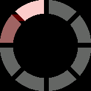
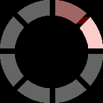
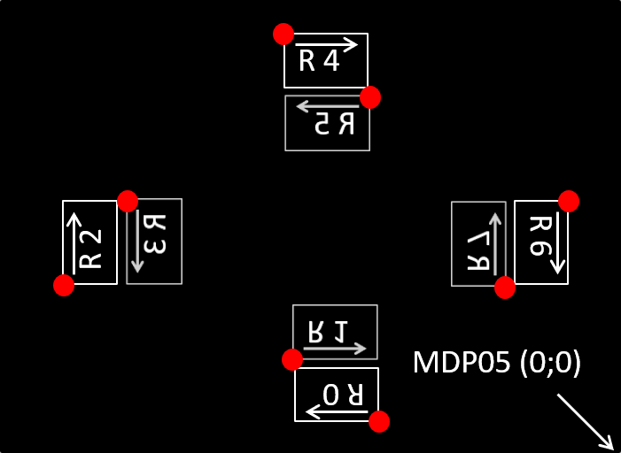
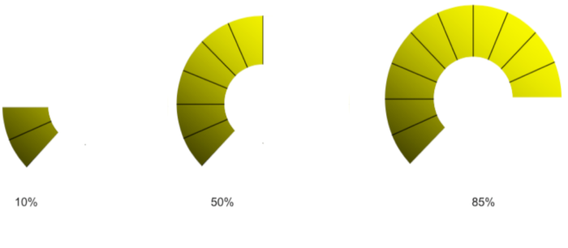
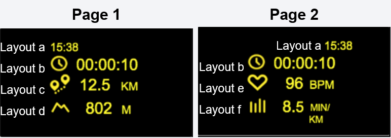

<!-- 
Date:
Owner: XB
Reviewers: BC,MW,SR,XB @ Microoled
Version: 1.0.0
Note: Use a markdown editor to view HTML rendering (this file was created with MacDown ).
-->

# ActiveLook® Programming Interface 

<p align="center"> 

# Table of Contents
* 1. [Introduction](#Introduction)
* 2. [A Bluetooth Low Energy protocol](#ABluetoothLowEnergyprotocol)
	* 2.1. [BLE & GATT](#BLEGATT)
	* 2.2. [Advertising](#Advertising)
	* 2.3. [Services and characteristics](#Servicesandcharacteristics)
* 3. [Command Interface Service](#CommandInterfaceService)
	* 3.1. [Rx server](#Rxserver)
	* 3.2. [Tx server](#Txserver)
	* 3.3. [User data server](#Userdataserver)
	* 3.4. [Sensor server](#Sensorserver)
	* 3.5. [Flow Control server](#FlowControlserver)
* 4. [ActiveLook® Commands](#ActiveLookCommands)
	* 4.1. [Scalar Value Types](#ScalarValueTypes)
	* 4.2. [Glossary](#Glossary)
	* 4.3. [General commands](#Generalcommands)
	* 4.4. [Display luminance commands](#Displayluminancecommands)
	* 4.5. [Optical sensor commands](#Opticalsensorcommands)
	* 4.6. [Graphics commands](#Graphicscommands)
	* 4.7. [Images commands](#Imagescommands)
	* 4.8. [Font commands](#Fontcommands)
	* 4.9. [Layout commands](#Layoutcommands)
	* 4.10. [Gauge commands](#Gaugecommands)
	* 4.11. [Page commands](#Pagecommands)
	* 4.12. [Animation commands](#Animationcommands)
	* 4.13. [Statistics commands](#Statisticscommands)
	* 4.14. [Configuration commands](#Configurationcommands)
	* 4.15. [Device commands](#Devicecommands)
	* 4.16. [Deprecated commands](#Deprecatedcommands)
* 5. [ActiveLook® commands guide](#ActiveLookcommandsguide)
	* 5.1. [Color](#Color)
	* 5.2. [Luma](#Luma)
	* 5.3. [Graphical Objects](#GraphicalObjects)
	* 5.4. [Configurations](#Configurations)
	* 5.5. [Images](#Images)
		* 5.5.1. [Saving Image, 4 bits per pixel](#SavingImage4bitsperpixel)
		* 5.5.2. [Saving Image, 1 bit per pixel](#SavingImage1bitperpixel)
		* 5.5.3. [Streaming Image](#StreamingImage)
		* 5.5.4. [Coordinates](#Coordinates)
	* 5.6. [Animation](#Animation)
		* 5.6.1. [Saving animation](#Savinganimation)
		* 5.6.2. [Animation display](#Animationdisplay)
		* 5.6.3. [Stopping and clearing animation](#Stoppingandclearinganimation)
	* 5.7. [Text](#Text)
	* 5.8. [Shift](#Shift)
	* 5.9. [Font](#Font)
	* 5.10. [Layout](#Layout)
		* 5.10.1. [Layout Position](#LayoutPosition)
		* 5.10.2. [Default configuration](#Defaultconfiguration)
	* 5.11. [Gauge](#Gauge)
	* 5.12. [Page](#Page)
* 6. [UI design, Good practices](#UIdesignGoodpractices)
	* 6.1. [What is ‘changing’, what is ‘fixed’ in your UI?](#WhatischangingwhatisfixedinyourUI)
	* 6.2. [Think ‘erasing’](#Thinkerasing)
	* 6.3. [Aligning text](#Aligningtext)
	* 6.4. [Useful display area](#Usefuldisplayarea)
	* 6.5. [Optical Quality guidelines](#OpticalQualityguidelines)
	* 6.6. [BLE data transfer](#BLEdatatransfer)
	* 6.7. [Images and Fonts](#ImagesandFonts)
	* 6.8. [Layouts and Pages](#LayoutsandPages)
* 7. [Credit](#Credit)
* 8. [Support](#Support)

##  1. <a name='Introduction'></a>Introduction
The ActiveLook® solution has been designed to provide a low-power head-up display user interface in glasses. The cornerstone behind the low-power performance lays in the specific display and its management.

<p align="center"> 

ActiveLook® glasses typically includes:

* Glasses frame and specifically designed lenses protecting the user from wind and sunlight as well as maximizing the visual experience.
* An optical system projecting the image from the display into the user field of view.
* A low energy consumption and high brightness MICROOLED® memory based microdisplay with a resolution of 304 x 256 pixels (16 grey levels).
* An electronic module managing the BLE interface and the display operation.
* A capacitive sensor.
* A gesture sensor.
* An ambient light sensor.
* An application on an external BLE-enabled device (smartphone, smartwatch, bike computer, …) managing the information and driving the glasses.


##  2. <a name='ABluetoothLowEnergyprotocol'></a>A Bluetooth Low Energy protocol

###  2.1. <a name='BLEGATT'></a>BLE & GATT

The basic technologies behind the ActiveLook® display management are [Bluetooth Low Energy (BLE)](https://en.wikipedia.org/wiki/Bluetooth_Low_Energy) and [GATT](https://www.bluetooth.com/specifications/gatt).

They allow "discovery" and communication between ActiveLook® glasses (slave device) and a master BLE device. In general, you have to know about services and characteristics to communicate with a BLE device.

###  2.2. <a name='Advertising'></a>Advertising
The advertising interval is set to 25 ms at startup.
 
After 30 seconds without a connection request from a master device, the advertising interval is set to 250 ms.

After 3 minutes without a connection request, the advertising is stopped and the device is turned off.


An ActiveLook® device advertises with the following data:

**Default Advertising Address**

`80 EA XX XX XX XX`, where `XX XX XX XX` is the hexadecimal serial number of the device

**Advertising Data**

The ActiveLook® device will advertise the following data : 

Device complete name, (16 characters): 

- BLE advertising data identifier = `0x09`
- First characters for Model Name (10 char max, padding with space (`0x20`) if the name is shorter, then 6 characters for Customer Serial Number. Default value='A.Look    xxxxxx', where xxxxxx is the serial number of the glasses. This name can be customized with the `setName` command. 

UIID list, SUOTA (Software Upgrade Over The Air) service UUID. 

- BLE advertising data identifier = `0x02`
- value = `0xFEF5`


Manufacturer data (customer manufacturer ID and MICROOLED manufacturer ID)

- BLE advertising data identifier = `0xFF`
- Default value = `0xDAFA08F2`, where `0x08F2` is a reserved ActiveLook® value and `0xDAFA` is customer manufacturer ID


Each data is preceded by two bytes, one for length (including identifier), one for data identifier. 

Exemple: `0x` `1109412E4C6F6F4B20202020303030313238` `0302F5F2` `05FFFADA08F2`.

⚠ It is recommended to filter Bluetooth devices during discovery by manufacturer ID ending by `0x08F2`  


###  2.3. <a name='Servicesandcharacteristics'></a>Services and characteristics 

The following services are implemented in the BLE interface (four are standard services and two are custom for dedicated ActiveLook® commands and firmware updates).

**Generic Attribute**

UUID `0x1801`

Without characteristics

**Generic Access**

UUID `0x1800`

| Characteristic                             | UUID                                   | Property | Value                 |
| ------------------------------------------ | -------------------------------------- | -------- | --------------------- |
| Device Name                                | `00002A00-0000-1000-8000-00805F9B34FB` | Read     | `A.LooK`              |
| Appearance                                 | `00002A01-0000-1000-8000-00805F9B34FB` | Read     | `Generic Eye-glasses` |
| Peripheral Preferred Connection Parameters | `00002A04-0000-1000-8000-00805F9B34FB` | Read     | `0x0800100000006400`  |


**Device Information Service**

UUID `0x180A`

| Characteristic           | UUID                                   | Property | Value       |
| ------------------------ | -------------------------------------- | -------- | ----------- |
| Manufacturer Name String | `00002A29-0000-1000-8000-00805F9B34DB` | Read     | `Microoled` |
| Model Number String      | `00002A24-0000-1000-8000-00805F9B34DB` | Read     | `A.LooK`    |
| Serial Number String     | `00002A25-0000-1000-8000-00805F9B34DB` | Read     | `xxxxxxxxxx`|
| Hardware version String  | `00002A27-0000-1000-8000-00805F9B34DB` | Read     | `rev B1`    |
| Firmware version String  | `00002A26-0000-1000-8000-00805F9B34DB` | Read     | `3.0.0`     |
| Software version String  | `00002A28-0000-1000-8000-00805F9B34DB` | Read     | `1.0.0.1`   |

**Battery Service**

UUID `0x180F`

| Characteristic | UUID                                   | Property    | Value                |
| -------------- | -------------------------------------- | ----------- | -------------------- |
| Battery Level  | `00002A19-0000-1000-8000-00805F9B34FB` | Read Notify | battery level (in %) |

Descriptor : UUID `0x2902` characteristic configuration

⚠ If notifications are enabled by the BLE client, the device will notify the battery level once every 30s.

**Custom Service (ActiveLook® Commands Interface)**

UUID `0x0783b03e-8535-b5a0-7140-a304d2495cb7`


| Characteristic          | UUID                                   | Property                 | Descriptors                                                                 |
|-------------------------|----------------------------------------|--------------------------|-----------------------------------------------------------------------------|
| TX ActiveLook           | `0783b03e-8535-b5a0-7140-a304d2495cb8` | Read Notify              | UUID `0x2902` configuration<br>UUID `0x2901` description: `Server Tx Data`  |
| RX ActiveLook           | `0783b03e-8535-b5a0-7140-a304d2495cbA` | Write, Write no response | UUID `0x2902` configuration<br>UUID `0x2901` description: `Server Rx Data`  |
| Flow Control            | `0783b03e-8535-b5a0-7140-a304d2495cb9` | Notify                   | UUID `0x2902` configuration<br>UUID `0x2901` description: `Flow Control`    |
| Gesture Event           | `0783b03e-8535-b5a0-7140-a304d2495cbb` | Notify                   | UUID `0x2902` configuration<br>UUID `0x2901` description: `Gesture Event`   |
| Touch Event             | `0783b03e-8535-b5a0-7140-a304d2495cbc` | Notify                   | UUID `0x2902` configuration<br>UUID `0x2901` description: `Touch Event`     |


**Custom Service (firmware update service)**

UUID `0000FEF5-0000-1000-8000-00805F9B34FB`

(Reserved) 

##  3. <a name='CommandInterfaceService'></a>Command Interface Service

###  3.1. <a name='Rxserver'></a>Rx server

The custom service Rx server characteristic is used to send commands to an ActiveLook® device.

⚠ The RX server allows both Bluetooth `WRITE` (with response) and `WRITE_NO_RESPONSE` mode. It is highly recommended to use `WRITE` (with response) mode. Depending on the master device Bluetooth stack efficiency (for instance on connected watches) `WRITE_NO_RESPONSE` (lower latency) can be used.

⚠ The command interface uses BINARY encoding.

⚠ All data are in Big Endian (example: to encode 1024, the first byte to send is `0x04`, followed by `0x00`)


A command includes a header and a footer. The header is made of START + Command ID + Command Format + length (+ Query ID). The command layout is as follows:

**Start**: always `0xFF`

**Command ID**: command identifier 

**Command Format**: define the format of the command, including the number of bytes of the length (1 or 2 bytes) and the number of bytes of the queryID (0 to 15 bytes). Bit 5 (0bx0000) defines the size of `Length`, 1: length on 2  bytes, 0 length on 1 byte. Bit 4 to 1 (0bxxxx) define the size of `Query ID` in bytes.

**Length**: defines the length of the whole command header and footer included. The length can use one or two bytes depending on the command format. The maximum length is `533` bytes with `512` bytes of data and `15` bytes of queryId.

**Query ID** (optional): defined by the user, it allows to identify a command (query) and the associated response. When a queryId is sent with the command, the response includes this queryId, allowing the user to match the response with the original command in an asynchronous system.

**Data** (optional): parameters of the command

**Footer**: always `0xAA`


| 0xFF   | 0x..       | 0x0n           | 0x..        | n * 0x…   | m * 0x…        | 0xAA   |
|--------|------------|----------------|-------------|-----------|----------------|--------|
| Start  | Command ID | Command Format | Length      | Query ID  | Data           | Footer |
| 1B     | 1B         | 1B             | 1B          | nB        | mB             | 1B     |

| 0xFF   | 0x..       | 0x1n           | 0x.. 0x..   | n * 0x…  | m * 0x…        | 0xAA   |
|--------|------------|----------------|-------------|----------|----------------|--------|
| Start  | Command ID | Command Format | Length      | Query ID | Data           | Footer |
| 1B     | 1B         | 1B             | 2B          | nB       | mB             | 1B     |

⚠ A Command can be sent in multiple BLE chunks. The length and presence of a footer are checked to reconstruct the whole command.


⚠ The MTU, which should be negotiated at connection, will determine the maximum number of bytes in a chunk.

Examples of `Command Format` usage with command `clear` used to clear the display (black screen):  

|                                          | Start  | Command ID | Command Format | Length    | Query ID             | Data     | Footer |
|------------------------------------------|--------|------------|----------------|-----------|----------------------|----------|--------|
| `Query ID`: 0 Byte<br>`Length`: 1 Bytes  | 0xFF   | 0x01       | 0x00           | 0x05      | -                    | -        | 0xAA   |
| `Query ID`: 2 Bytes<br>`Length`: 1 Bytes | 0xFF   | 0x01       | 0x02           | 0x07      | 0x02 0x01            | -        | 0xAA   |
| `Query ID`: 0 Byte<br>`Length`: 2 Bytes  | 0xFF   | 0x01       | 0x10           | 0x00 0x06 | -                    | -        | 0xAA   |
| `Query ID`: 4 Bytes<br>`Length`: 2 Bytes | 0xFF   | 0x01       | 0x14           | 0x00 0x0A | 0x04 0x03 0x02 0x01  | -        | 0xAA   |

###  3.2. <a name='Txserver'></a>Tx server

The Tx server allows communicating from the device to the master device through notifications. 

⚠ The notifications should be enabled by the master device to be able to access this information.

###  3.3. <a name='Userdataserver'></a>User data server 

The user data server is used for notifying the master device of user interactions with the ActiveLook® device.
When the user touches the capacitive button for a short time (<3s) a notification is sent on the user data server to the master application

Capacitive button notification value: `1`

⚠ The notifications should be enabled by the master device to be able to access this information.

###  3.4. <a name='Sensorserver'></a>Sensor server

The sensor server is used for notifying the master device of user gesture detection.
When a gesture is detected on the glasses (hand motion), a notification is sent on the sensor server to the master application.

Gesture notification value: `1`

⚠ The notifications should be enabled by the master device to be able to access this information.

###  3.5. <a name='FlowControlserver'></a>Flow Control server

The Flow Control server provides a method to prevent the application on the Client Device from overloading the BLE memory buffer of the ActiveLook® device. The ActiveLook® device will notify the Client device when the Rx Buffer is getting full, the Client device is required to stop sending data at this time. When the Rx Buffer has been reduced to a safe level, the ActiveLook® device will notify the Client Device to re-start the flow of data. 

Flow control values:  

| Value  | Type       | Description                                                                  |
|--------|------------|------------------------------------------------------------------------------|
| 0x01   | Flow Ctrl  | master can send data                                                         |
| 0x02   | Flow Ctrl  | master should stop sending data and wait value return to 0x01                |
| 0x03   | Error      | message error, the command was incomplete or corrupt, the command is ignored |
| 0x04   | Error      | Receive message queue overflow                                               |
| 0x05   | Error      | Reserved                                                                     |
| 0x06   | Error      | Missing the `cfgWrite` command before configuration modification             |

On error, the value is conserved until a new command is received.

⚠ The notifications should be enabled by the master device to be able to access this information.

##  4. <a name='ActiveLookCommands'></a>ActiveLook® Commands

###  4.1. <a name='ScalarValueTypes'></a>Scalar Value Types

⚠ All data are Most Significant Byte (MSB) First.  
Example: to encode 1024 on 2 bytes, the first byte is `0x04`, followed by `0x00`.  

The command parameters can use the following types:  

| Type   | C++ Equivalent      | Size (Bytes) | Range                            |
|--------|---------------------|--------------|----------------------------------|
| u32    | uint32_t MSB 1st    |            4 | 0 to 4 294 967 295               |
| s32    | int32_t MSB 1st     |            4 | -2 147 483 648 to 2 147 483 647  |
| u16    | uint16_t MSB 1st    |            2 | 0 to 65 535                      |
| s16    | int16_t MSB 1st     |            2 | -32 768 to 32 767                |
| u8     | uint8_t             |            1 | 0 to 255                         |
| s8     | int8_t              |            1 | -128 to 127                      |
| bool   | uint8_t             |            1 | 0 to 1                           |
| str    | c_str               |            n | ASCII char only                  |

If the string length is shorter than the maximum length. The string must be NUL terminated (c-string) and only useful data can be sent.

###  4.2. <a name='Glossary'></a>Glossary

`r`: radius  
`f`: font  
`c`: color  
`bpp`: bit per pixel  
`B`: byte  


###  4.3. <a name='Generalcommands'></a>General commands

**Master to ActiveLook**

| ID   | commands  | parameters                | Data length (B)    | Description                                                  |
|------|-----------|---------------------------|--------------------|--------------------------------------------------------------|
| 0x00 | power     | `bool en`                 | 1                  | Enable / disable power of the display                        |
| 0x01 | clear     | -                         | 0                  | Clear the display memory (black screen)                      |
| 0x02 | grey      | `u8 lvl`                  | 1                  | Set the whole display to the corresponding grey level (0 to 15) |
| 0x03 | demo      | `u8 demo_id`              | 1                  | Display demonstration:<br>0: Fill screen<br>1: Rectangle with a cross in it<br>2: display saved images, call multiple times to go through all saved images |
| 0x04 | setTimers | `u8 timer_id`<br>`u16 or u32 duration` | 3 or 5 | Change timer duration:<br>timer 0: Touch duration to trigger a boot. Value: 1 to 65 535 ms<br>timer 1: touch duration for a shutdown. Value: 1 to 65 535 ms<br>timer 2: reserved<br>timer 3: Delay before power down when no connection established. Value: 0 (disable) to 4 294 967 295 ms<br>timer 4: 1st Splash screen duration (layout #0). Value: 1 to 65 535 ms<br>timer 5: 2nd Splash screen duration (layout #1). Value: 1 to 65 535 ms |
| 0x05 | battery   | -                         | 0                  | Get the battery level in %                                   |
| 0x06 | vers      | -                         | 0                  | Get the device ID and firmware version                       |
| 0x08 | led       | `u8 state`                | 1                  | Set green LED:<br>0: Off<br>1: On<br>2: Toggle<br>3: Blinking |
| 0x09 | shift     | `s16 x`<br>`s16 y`        | 4                  | Shift all subsequently displayed objects of (`x`,`y`) pixels. Valid values are between -128 and 127 |
| 0x0A | settings  | -                         | 0                  | Return the user parameters (shift, luma, sensor)             |

**ActiveLook to Master**

| ID   | commands | data                                                     | Data length (B) | Description                                                  |
|------|----------|----------------------------------------------------------|-----------------|--------------------------------------------------------------|
| 0x05 | battery  | `u8 level`                                               | 1               | Battery level in % (0x64 = 100%)                             |
| 0x06 | vers     | `u8 fwVersion[4]`<br>`u8 mfcYear`<br>`u8 mfcWeek`<br>`u8 serialNumber[3]` | 9               | `fw version` format: 3.5.0b = `0x03 0x05 0x00 0x62`<br>`mfcYear`: manufacturing year<br>`mfcWeek`: manufacturing week<br> `serial number` example: `0x00 0x00 0x02` |
| 0x0A | settings | `s8 x`<br>`s8 y`<br>`u8 luma`<br>`bool alsEnable`<br>`bool gestureEnable` | 5               | `x`: global x shift<br>`y`: global y shift<br>`luma`: display luminance (0 to 15)<br>`alsEnable`: auto-brightness adjustment status<br>`gestureEnable`: gesture detection status |


###  4.4. <a name='Displayluminancecommands'></a>Display luminance commands

**Master to ActiveLook**

| ID   | commands | parameters         | Data length (B)    | Description                                                    |
|------|----------|--------------------|--------------------|----------------------------------------------------------------|
| 0x10 | luma     | `u8 level`         | 1                  | Set the display luminance to the corresponding level (0 to 15) |


###  4.5. <a name='Opticalsensorcommands'></a>Optical sensor commands

**Master to ActiveLook**

| ID   | commands            | parameters                       | Data length (B) | Description                                                      |
|------|---------------------|----------------------------------|-----------------|------------------------------------------------------------------|
| 0x20 | sensor              | `bool en`                        | 1               | Turn on/off the auto-brightness adjustment and gesture detection |
| 0x21 | gesture             | `bool en`                        | 1               | Turn on/off only the gesture detection                           |
| 0x22 | als                 | `bool en`                        | 1               | Turn on/off only the auto-brightness adjustment                  |


###  4.6. <a name='Graphicscommands'></a>Graphics commands

**Master to ActiveLook**

| ID   | commands   | Parameters                                   | Data length (B) | Description                                                              |
|------|------------|----------------------------------------------|-----------------|--------------------------------------------------------------------------|
| 0x30 | color      | `u8 color`                                   | 1               | Sets the grey level (0 to 15) used to draw the next graphical element    |
| 0x31 | point      | `s16 x`<br>`s16 y`                           | 4               | Set a pixel on at the corresponding coordinates                          |
| 0x32 | line       | `s16 x0`<br>`s16 y0`<br>`s16 x1`<br>`s16 y1` | 8               | Draw a line at the corresponding coordinates                             |
| 0x33 | rect       | `s16 x0`<br>`s16 y0`<br>`s16 x1`<br>`s16 y1` | 8               | Draw an empty rectangle at the corresponding coordinates                 |
| 0x34 | rectf      | `s16 x0`<br>`s16 y0`<br>`s16 x1`<br>`s16 y1` | 8               | Draw a full rectangle at the corresponding coordinates                   |
| 0x35 | circ       | `s16 x`<br>`s16 y`<br>`u8 r`                 | 5               | Draw an empty circle at the corresponding coordinates                    |
| 0x36 | circf      | `s16 x`<br>`s16 y`<br>`u8 r`                 | 5               | Draw a full circle at the corresponding coordinates                      |
| 0x37 | txt        | `s16 x`<br>`s16 y`<br>`u8 r`<br>`u8 f`<br>`u8 c`<br>`str string[255]` | >= 8            | Write text `string` at coordinates (x,y) with rotation, font size, and color |
| 0x38 | polyline   | `s16 x0`<br>`s16 y0`<br>...<br>`s16 xN`<br>`s16 yN` | (n + 1) * 4     | Draw multiple connected lines at the corresponding coordinates |


###  4.7. <a name='Imagescommands'></a>Images commands

**Master to ActiveLook**

| ID   | commands    | Parameters                             | Data length (B)         | Description                                                     |
|------|-------------|----------------------------------------|-------------------------|-----------------------------------------------------------------|
| 0x41 | imgSave     | `u8 id`<br>`u32 size`<br>`u16 width`   | 7 for the first chunk   | Save 4bpp image of `size` bytes and `width` pixels              |
| 0x42 | imgDisplay  | `u8 id`<br>`s16 x`<br>`s16 y`          | 5                       | Display image `id` to the corresponding coordinates<br>Coordinates are signed, they can be negative |
| 0x44 | imgStream   | `u32 size`<br>`u16 width`<br>`s16 x`<br>`s16 y` | 10 for the first chunk | Stream 1bpp bitmap image on display without saving it in memory |
| 0x45 | imgSave1bpp | `u32 size`<br>`u16 width`              | 6 for the first chunk   | Save 1bpp bitmap of `size` bytes and `width` pixels             |
| 0x46 | imgDelete   | `u8 id`                                | 1                       | Delete image<br>if `id`= 0xFF, delete all images                |
| 0x47 | imgList     | -                                      | 0                       | Give the list of saved images                                   |

**ActiveLook to Master**

| ID   | commands | data                        | Data length (B) | Description                                                  |
|------|----------|-----------------------------|-----------------|--------------------------------------------------------------|
| 0x47 | imgList  | `u8 id`<br>`u16 height`<br>`u16 width`<br>...<br>`u8 idN`<br>`u16 heightN`<br>`u16 widthN` | 5 x n           | list of images in memory<br>`height`and `width` are in pixel<br>Listing is not sorted |


###  4.8. <a name='Fontcommands'></a>Font commands

**Master to ActiveLook**

| ID   | commands      | Parameters                             | Data length (B)         | Description                                                  |
|------|---------------|----------------------------------------|-------------------------|--------------------------------------------------------------|
| 0x50 | fontList      | -                                      | 0                       | Give the list of saved fonts with their height               |
| 0x51 | fontSave      | 1st chunk: `u8 id` `u16 size`<br>Then: `u8 data[n]` | 3 for the first chunk  | Save font `id` of `size` Bytes                               |
| 0x52 | fontSelect    | `u8 id`                                | 1                       | Selects font which will be used for followings text commands |
| 0x53 | fontDelete    | `u8 id`                                | 1                       | Delete font from memory<br>if `id`= 0xFF, delete all fonts   |

**ActiveLook to Master**

| ID   | commands | data                                    | Data length (B) | Description                                         |
|------|----------|-----------------------------------------|-----------------|-----------------------------------------------------|
| 0x50 | fontList | `u8 id`<br>`u8 height`<br>...<br>`u8 idN`<br>`u8 heightN` | 2 x n           | list of font in memory with there height<br>Listing is not sorted |


###  4.9. <a name='Layoutcommands'></a>Layout commands

⚠ Layout coordinates are unsigned, they are only positive.

**Master to ActiveLook**

| ID   | commands              | Parameters                    | Data length (B)    | Description                                             |
|------|-----------------------|-------------------------------|--------------------|---------------------------------------------------------|
| 0x60 | layoutSave            | `layout parameters`           | >= 17              | Save a layout                                           |
| 0x61 | layoutDelete          | `u8 id`                       | 1                  | Delete a layout<br>if `id` = 0xFF, delete all layouts   |
| 0x62 | layoutDisplay         | `u8 id`<br>`str text[255]`    | 2                  | Display `text` with layout `id` parameters              |
| 0x63 | layoutClear           | `u8 id`                       | 1                  | Clears screen of the corresponding layout area          |
| 0x64 | layoutList            | -                             | 0                  | Give the list of saved layouts                          |
| 0x65 | layoutPosition        | `u8 id`<br>`u16 x`<br>`u8 y`  | 4                  | Redefine the position of a layout<br>The position is saved |
| 0x66 | layoutDisplayExtended | `u8 id`<br>`u16 x`<br>`u8 y`<br>`str text[255]` | 5   | Display `text` with layout `id` at position `x` `y`<br>The position is not saved |
| 0x67 | layoutGet             | `u8 id`                       | 1                  | Get a layout parameters                                 |
| 0x68 | layoutClearExtended   | `u8 id`<br>`u16 x`<br>`u8 y`  | 4                  | Clears screen of the corresponding layout area          |

**ActiveLook to Master**

| ID   | commands   | data                           | Data length (B) | Description                                         |
|------|------------|--------------------------------|-----------------|-----------------------------------------------------|
| 0x64 | layoutList | `u8 id`<br>...<br>`u8 idN`     | n               | list of layouts in memory<br>Listing is not sorted  |
| 0x67 | layoutGet  | `layout parameters`            | >= 17           | Layouts parameters without `id`                     |


###  4.10. <a name='Gaugecommands'></a>Gauge commands

**Master to ActiveLook**

| ID   | commands     | Parameters                    | Data length (B) | Description                                        |
|------|--------------|-------------------------------|-----------------|----------------------------------------------------|
| 0x70 | gaugeDisplay | `u8 id`<br>`u8 value`         | 2               | Display value (in percentage) of the gauge         |
| 0x71 | gaugeSave    | `u8 id`<br>`s16 x`<br>`s16 y`<br>`u16 r`<br>`u16 rIn`<br>`u8 start`<br>`u8 end`<br>`bool clockWise` | 12 | Save the parameters for the gauge `id` |
| 0x72 | gaugeDelete  | `u8 id`                       | 1                  | Delete a gauge<br>if `id`= 0xFF, delete all gauges |
| 0x73 | gaugeList    | -                             | 0                  | Give the list of saved gauges                   |
| 0x74 | gaugeGet     | `u8 id`                       | 1                  | Get a gauge parameters                          |

**ActiveLook to Master**

| ID   | commands   | data                           | Data length (B) | Description                                         |
|------|------------|--------------------------------|-----------------|-----------------------------------------------------|
| 0x73 | gaugeList  | `u8 id`<br>...<br>`u8 idN`     | n               | list of gauges in memory<br>Listing is not sorted   |
| 0x74 | gaugeGet   | `s16 x`<br>`s16 y`<br>`u16 r`<br>`u16 rIn`<br>`u8 start`<br>`u8 end`<br>`bool clockWise` | 11 | Gauge parameters without `id` |


###  4.11. <a name='Pagecommands'></a>Page commands                      

**Master to ActiveLook**

| ID   | commands    | Parameters                                                | Data length (B) | Description                                   |
|------|-------------|-----------------------------------------------------------|-----------------|-----------------------------------------------|
| 0x80 | pageSave    | `u8 id`<br>`u8 layoutId1`<br>`u16 x1`<br>`u8 y1`<br>...<br>`u8 layoutIdN`<br>`u16 xN`<br>`u8 yN` | 1 + n x 4 | Save a page of layouts |
| 0x81 | pageGet     | `u8 id`                                                   | 1               | Get a page                                    |
| 0x82 | pageDelete  | `u8 id`                                                   | 1               | Delete a page<br>if `id`= 0xFF, delete all pages |
| 0x83 | pageDisplay | `u8 id`<br>`str string1`<br>...<br>`str stringN`          | >= 2            | Display a page, each string are NUL separated |
| 0x84 | pageClear   | `u8 id`                                                   | 1               | Clears screen of the corresponding page area  |
| 0x85 | pageList    | -                                                         | 0               | List page in memory                           |

**ActiveLook to Master**

| ID   | commands  | data                                                       | Data length (B) | Description                                         |
|------|-----------|------------------------------------------------------------|-----------------|-----------------------------------------------------|
| 0x81 | pageGet   | `u8 id`<br>`u8 layoutId1`<br>`u16 x1`<br>`u8 y1`<br>...<br>`u8 layoutIdN`<br>`u16 xN`<br>`u8 yN` | 1 + n x 4       | Page with layouts parameters |
| 0x85 | pageList  | `u8 id`<br>...<br>`u8 idN`                                 | n               | List of page IDs in memory<br>Listing is not sorted |


###  4.12. <a name='Animationcommands'></a>Animation commands

**Master to ActiveLook**

| ID   | commands    | Parameters            | Data length (B)        | Description                                   |
|------|-------------|-----------------------|------------------------|-----------------------------------------------|
| 0x95 | animSave    | `u8 id`<br>`u32 totalSize`<br>`u32 imgSize`<br>`u16 width` | 11 for the first chunk | Save an animation of `totalSize` bytes<br>`u32 imgSize` if the reference frame size in byte |
| 0x96 | animDelete  | `u8 id`               | 1                      | Delete an animation<br>if `id` = 0xFF, delete all animations |
| 0x97 | animDisplay | `u8 handlerId`<br>`u8 id`<br>`u16 delay`<br>`u8 repeat`<br>`s16 x`<br>`s16 y` | 9 | Display animation `id` to the corresponding coordinates<br>`delay` set the inter-frame duration in ms<br>`handlerId` value is specified by the user and used to stop the animation<br>`repeat` is for the repeat count or 0xFF for infinite repetition<br>Coordinates are signed, they can be negative |
| 0x98 | animClear   | `u8 handlerId`        | 1                      | Stop and clear the screen of the corresponding animation<br>if `handlerId` = 0xFF, clear all animations |
| 0x99 | animList    | -                     | 0                      | Give the list of saved animations             |

**ActiveLook to Master**

| ID   | commands  | data                        | Data length (B) | Description                                           |
|------|-----------|-----------------------------|-----------------|-------------------------------------------------------|
| 0x81 | animList  | `u8 id`<br>...<br>`u8 idN`  | n               | list of animations in memory<br>Listing is not sorted |


###  4.13. <a name='Statisticscommands'></a>Statistics commands

**Master to ActiveLook**

| ID   | commands           | Parameters               | Data length (B) | Description                                             |
|------|--------------------|--------------------------|-----------------|---------------------------------------------------------|
| 0xA5 | pixelCount         | -                        | 0               | Get the number of pixels activated on the display       |
| 0xA7 | getChargingCounter | -                        | 0               | Get the total number of battery charging cycle          |
| 0xA8 | getChargingTime    | -                        | 0               | Get the total number of battery charging minute         |
| 0xAA | resetChargingParam | -                        | 0               | Reset charging counter and charging time values         |

**ActiveLook to Master**

| ID   | commands           | data        | Data length (B) | Description                                         |
|------|--------------------|-------------|-----------------|-----------------------------------------------------|
| 0xA5 | pixelCount         | `u32 count` | 4               | Number of pixels activated on display               |
| 0xA7 | getChargingCounter | `u32 count` | 4               | Total number of battery charging cycle              |
| 0xA8 | getChargingTime    | `u32 time`  | 4               | Total battery charging duration in minute           |


###  4.14. <a name='Configurationcommands'></a>Configuration commands

⚠ Configurations names maximum length is 12 bytes. If the name is shorter than 12 bytes, it must be NUL terminated (c-string)

**Master to ActiveLook**

| ID   | commands        | Parameters                                  | Data length (B) | Description                                                       |
|------|-----------------|---------------------------------------------|-----------------|-------------------------------------------------------------------|
| 0xD0 | cfgWrite        | `str name[12]`<br>`u32 version`<br>`u32 password` | 10 <= n <= 20 | Write configuration, configurations are associated with layouts, images, etc<br>`name`: name of the configuration<br>`version`: provided by the user for tracking versions of configuration<br>`password`: if configuration already exists, the same password must be provided as the one used during the creation |
| 0xD1 | cfgRead         | `str name[12]`                              | 2 <= n <= 12    | Get the number of elements stored in the configuration            |
| 0xD2 | cfgSet          | `str name[12]`                              | 2 <= n <= 12    | Select the current configuration used to display layouts, images, etc |
| 0xD3 | cfgList         | -                                           | 0               | List configurations in memory                                     |
| 0xD4 | cfgRename       | `str old[12]`<br>`str new[12]`<br>`u32 password` |  8 <= n <= 28 | Rename a configuration                                         |
| 0xD5 | cfgDelete       | `str name[12]`                              | 2 <= n <= 12    | Delete a configuration and all elements associated                |
| 0xD6 | cfgDeleteLessUsed |                                           | 0               | Delete the configuration that has not been used for the longest time |
| 0xD7 | cfgFreeSpace    | -                                           | 0               | Get free space available to store layouts, images, etc            |
| 0xD8 | cfgGetNb        | -                                           | 0               | Get number of configurations in memory                            |

**ActiveLook to Master**

| ID   | commands     | data                               | Data length (B) | Description                                                  |
|------|--------------|------------------------------------|-----------------|--------------------------------------------------------------|
| 0xD1 | cfgRead      | `u32 version`<br>`u8 nbImg`<br>`u8 nbLayout`<br>`u8 nbFont`<br>`u8 nbPage`<br>`u8 nbGauge` | 9 | number of elements stored in the configuration |
| 0xD3 | cfgList      | `str name1[12]`<br>`u32 size1`<br>`u32 version1`<br>`u8 usgCnt1`<br>`u8 installCnt1`<br>`bool isSystem1`<br>...<br>`str nameN[12]`<br>`u32 sizeN`<br>`u32 versionN`<br>`u8 usgCntN`<br>`u8 installCntN`<br>`bool isSystemN` | 23 x n | `name`: name of the configuration<br>`size`: size of the configuration in bytes<br>`version`: provided by user, version of configuration<br>`usgCnt`: use to sort configuration, most recent used configuration have higher value<br>`installCnt`: use to sort configuration, most recent installed configuration have higher value<br>`isSystem`: indicate system configuration. System configuration can't be deleted |
| 0xD7 | cfgFreeSpace | `u32 totalSize`<br>`u32 freeSpace` | 8               | `totalSize`: total size available in byte<br>`freeSpace`: freeSpace available in byte |
| 0xD8 | cfgGetNb     | `u8 nbConfig`                      | 1               | number of configurations stored in memory |


###  4.15. <a name='Devicecommands'></a>Device commands

**Master to ActiveLook**

| ID   | commands  | parameters  | Data length (B) | Description                                                            |
|------|-----------|-------------|-----------------|------------------------------------------------------------------------|
| 0xE0 | shutdown  | `u8 key[4]` | 4               | Shutdown the device. The key must be equal to `0x6F 0x7F 0xC4 0xEE`<br>Shutdown is not allowed while USB powered |
| 0xE1 | reset     | `u8 key[4]` | 4               | Reset the device. The key must be equal to `0x5C 0x1E 0x2D 0xE9`       |


###  4.16. <a name='Deprecatedcommands'></a>Deprecated commands


| ID   | commands    | Parameters                               | Data length (B)         | Description                                                     |
|------|-------------|------------------------------------------|-------------------------|-----------------------------------------------------------------|
| 0x40 | imgList     | -                                        | 0                       | Give the list of saved images<br>Deprecated since 4.0.0          |
| 0x41 | imgSave     | `u32 size`<br>`u16 width`                | 6 for the first chunk   | Save 4bpp image of `size` bytes and `width` pixels<br>Parameter `id` was added in 4.0.0<br>it's still possible to send the command without `id` if the new version with `id` was never used |
| 0xA1 | WConfigID   | `u8 cfgId`<br>`u32 version`<br>`u8 unused[3]` | 8           | Write config, version is used to track which config is in the device<br>Deprecated since 4.0.0<br>`cfgId` 1 is redirected to system config<br>`cfgId` 2 redirect to a config named '2' |
| 0xA2 | RConfigID   | `u8 cfgId`                               | 1                       | Read config<br>Deprecated since 4.0.0                            |
| 0xA3 | SetConfigID | `u8 cfgId`                               | 1                       | Set current config to display images, layouts, and fonts<br>Deprecated since 4.0.0 |

**ActiveLook to Master**

| ID   | commands  | data                        | Data length (B) | Description                                                  |
|------|-----------|-----------------------------|-----------------|--------------------------------------------------------------|
| 0x40 | imgList   | `u16 height`<br>`u16 width`<br>...<br>`u16 heightN`<br>`u16 widthN` | 4 x n           | list of images in memory<br>`height`and `width` are in pixel<br>Prior to 4.0.0, image listing wasn't giving the image id<br>Deprecated since 4.0.0 |
| 0xA2 | RConfigID | `u8 cfgId`<br>`u32 version`<br>`u8 nbImg`<br>`u8 nbLayout`<br>`u8 nbFont` | 1    | Read config<br>Deprecated since 4.0.0 |

##  5. <a name='ActiveLookcommandsguide'></a>ActiveLook® commands guide

###  5.1. <a name='Color'></a>Color

The ActiveLook® OLED display is a monochrome display with 15 different grey levels. It is designed as a memory frame buffer that retains the data while not overwritten. As each pixel has only 15 grey levels, the memory is designed with 2 pixels per byte. 
It is possible to set the grey level with the color commands. The grey level will be saved in the device and will be used to draw all subsequent graphical objects until the color function is called again.


###  5.2. <a name='Luma'></a>Luma

Moreover, it is possible to set a global luminance setting (similar to brightness on different screens) between 15 parameters with the luma command. 


###  5.3. <a name='GraphicalObjects'></a>Graphical Objects

All shapes included in the graphical commands draw objects with the grey level previously defined with the color commands. 


###  5.4. <a name='Configurations'></a>Configurations

All graphical elements saved (layouts, images, etc) are regrouped in a configuration. Each application can use its configuration. Multiple configurations can be stored in the device allowing fast switching between applications.

Configurations share a memory pool of 3MB. The device has one 'System config' that can't be deleted and multiple 'user configs'. 'System config' is set during manufacturing and store 'System layouts' used for specific events (see Layout section).  

Before adding a new element, the user must ensure if there is enough memory available. This can be done with the `cfgFreeSpace` command. The maximum number of configurations is limited to 22.

On missing free space, some configurations must be deleted. Configurations can be listed with the `cfgList` command to get their size, usage order (`usgCnt`), and install/update order (`installCnt`).  
The 'install counter' is updated on the `cfgWrite` command, the 'usage counter' is updated on the `cfgSelect` command  
Also to reduce memory wear, counters may don't have consecutive values (Ex: 1, 2, gap, 5, 6...)  

Example of listing:  

| name          | size (kB) | version               | usage counter | install counter | config type |
|---------------|-----------|-----------------------|---------------|-----------------|-------------|
| 'ALooK'       | 39        | `0x00 0x00 0x00 0x04` | 0             | 0               | System      |
| 'config a'    | 60        | `0x01 0x06 0x0B 0x00` | 5             | 1               | User        |
| 'config b'    | 60        | `0x02 0x04 0x06 0x09` | 3             | 3               | User        |
| 'config c'    | 50        | `0x01 0x03 0x0B 0x0E` | 6             | 4               | User        |

'config c' is the most recent installed and used configuration  
'config a' is the oldest installed/updated configuration and 'config b' is the oldest used configuration  

With this information, the user can pick a configuration to delete.

To delete a specific configuration, the command `cfgDelete` can be used, or `cfgDeleteLessUsed` to delete the configuration that has not been used for the longest time

It's tricky to know the size required to store an element. It doesn't only depend on the size of the element but also the memory fragmentation and the number of elements per sector.  
A good rule is to have 10% of free memory before writing/modifying an element.  

`cfgList` only gives the size of the elements of each configuration. It's doesn't provide the space lost due to fragmentation and the if a sector reached the maximum number of elements. `cfgFreeSpace` gives an accurate view of the memory currently used.  

A sequence diagram of a configuration write:
<p align="center">

Before start using layouts, images, etc, the proper configuration must be selected. This can be done with the `cfgSelect` command.  

`cfgDelete`, `cfgDeleteLessUsed`, `cfgList`, `cfgFreeSpace` go through a lot of elements in memory. If the memory is full these operations can take a lot of time. If the smartphone communication layer has a timeout, a 20s timeout is recommended.  

###  5.5. <a name='Images'></a>Images

The graphical functions allow displaying images.  
The images must first be stored in the device with the `imgSave` command before being displayed.  
A first command defining the image data length in bytes and the image width in pixel must be sent.

⚠ The `cfgWrite` command is required before images upload.

- The image data is coded with 4 bits per pixel, and thus each byte defines two adjacent pixels

- The image data is sent in chunks with a maximum of 512 bytes.

- When sending images through BLE it is highly recommended to use the WRITE WITH RESPONSE Bluetooth protocol to make sure all data is properly saved.

The image data encoding can be implemented with ActiveStudio, a Microoled software running on Windows. A text file is generated with the encoded data to send to the device.

Once stored, it is possible to display the image with the `imgDisplay` command. 

At any moment it is possible to retrieve the list of the saved images with the `imgList` command.

####  5.5.1. <a name='SavingImage4bitsperpixel'></a>Saving Image, 4 bits per pixel

The `imgSave` command is used to save an image with 4bpp.

First, image identifier, 4bpp image size in bytes, and image width in pixels must be sent.  
If the image has an odd width, each line must be finished with a dummy pixel (4bit) included in the size.  

Example with 15 x 10 image: 

| FF       | 41         | 00         | 0C           | -        | 0A00000050000F              | AA     |
|----------|------------|------------|--------------|----------|-----------------------------|--------|
| Start ID | Command ID | Cmd Format | Frame length | Query ID | Data                        | End ID |

Data Parsing:

| image identifier | 4bpp image size in bytes        | image width      |
|------------------|---------------------------------|------------------|
| `0x0A`           | `0x00 0x00 0x00 0x50`           | `0x00 0x0F`      |
| 10               | 80 bytes, 10 lines of 16 pixels | 15 pixels        |

<br>

After, the image data must be sent with 4pp compression.  
Example of 4bpp compression for 5 pixels:

|      pixel number      |   1  |   2  |   3  |   4  |   5  | dummy |
|:----------------------:|:----:|:----:|:----:|:----:|:----:|:-----:|
| **pixel value (8bit)** |   0  |  32  |  64  |  128 |  255 |   NA  |
| **pixel value (4bit)** |   0  |   2  |   4  |   8  |  15  |   NA  |
|        **bytes**       | <span style="color:blue">0xX0</span> | <span style="color:blue">0x2X</span> | <span style="color:green">0xX4</span> | <span style="color:green">0x8X</span> | <span style="color:red">0xXF |  <span style="color:red">0x0X</span> |
|        **frame**       | 0x20 |      | 0x84 |      | 0x0F |       |

Example of compression loop in python:
``` python
## compress img into 4bpp
frame = []
for i in range(height):
	byte = 0
	shift = 0
	for j in range(width):
		## convert 8bpp to 4bpp
		pxl = round(gray[i,j] / 17)

		## compress 4bpp
		byte += pxl << shift
		shift += 4
		if shift == 8:
			frame.append(byte)
			byte = 0
			shift = 0
	if shift != 0:
		frame.append(byte)
```

<br>

Data are sent in chunks of 512 bytes with the command `imgSave`  
Example for a 15 x 10 image:  
``` python
## write config "Demo"
0xFFD0001244656D6F00000000000001E240AA
## save image #10, 80 bytes, 15 pixel width
0xFF41000C0A00000050000FAA
## image data, 10 lines of 8 bytes
0xFF410055113243557688A90A213244657798A90B214354668798BA0B3243557688A9BA0C3244657798A9BB0C4354668798BACB0D43657688A9BACC0D44657798A9BBDC0E54668798BACBDD0E657688A9BACCED0EAA
```

####  5.5.2. <a name='SavingImage1bitperpixel'></a>Saving Image, 1 bit per pixel

To reduce image transfer time, images can also be sent with 1bpp compression via command `imgSave1bpp`.  

⚠ The `cfgWrite` command is required before images upload.

First, image identifier, 1bpp image size in bytes, and image width in pixels must be sent.  
If the image width is not a multiple of 8, each line must be finished with dummies pixels included in the size.  

Example with 15 x 10 image: 

| FF       | 45         | 00         | 0C           | -        | 0A00000014000F              | AA     |
|----------|------------|------------|--------------|----------|-----------------------------|--------|
| Start ID | Command ID | Cmd Format | Frame length | Query ID | Data                        | End ID |

Data Parsing:

| image identifier | 1bpp image size in bytes        | image width      |
|------------------|---------------------------------|------------------|
| `0x0A`           | `0x00 0x00 0x00 0x14`           | `0x00 0x0F`      |
| 10               | 20 bytes, 10 lines of 16 pixels | 15 pixels        |

<br>

After, the image data must be sent with 1pp compression.  
Example of 1bpp compression for 5 pixels:

|      pixel number      |      1     |      2     |      3     |      4     |      5     |    dummies |
|:----------------------:|:----------:|:----------:|:----------:|:----------:|:----------:|:----------:|
| **pixel value (8bit)** |      0     |     32     |     64     |     128    |     255    |     NA     |
| **pixel value (1bit)** |      0     |      1     |      1     |      1     |      1     |     NA     |
|        **byte**        | 0bXXXXXXX0 | 0bXXXXXX1X | 0bXXXXX1XX | 0bXXXX1XXX | 0bXXX1XXXX | 0b000XXXXX |
|        **frame**       | 0x1E     


Example of compression loop in python:
``` python
## compress img 1 bit per pixel
frame = []
for i in range(height):
	byte = 0
	shift = 0
	line = []
	for j in range(width):
		## convert gray8bit in gray1bit
		if (gray[i,j] > 0):
			pxl = 1
		else:
			pxl = 0

		## compress 1bpp
		byte += pxl << shift
		shift += 1
		if shift == 8:
			line.append(byte)
			byte = 0
			shift = 0
	if shift != 0:
		line.append(byte)
	frame.append(line)
```

<br>

Data are sent in chunks of 512 bytes with command `imgSave1bpp`  
A line can't be truncate between two chunks. Each chunk must contain only complete lines.  

Example for a 15 x 10 image:  
``` python
## write config "Demo"
0xFFD0001244656D6F00000000000001E240AA
## save image #10, 20 bytes, 15 pixels width
0xFF45000C0A00000014000FAA
## image data, 10 lines of 2 bytes
0xFF450019C001300608080410022001400140814062211C1EAA
```

####  5.5.3. <a name='StreamingImage'></a>Streaming Image

It is also possible to stream images on display without saving them in memory with the command `imgStream`.  
This method is based on the same principle used to save bitmaps with 1 bit per pixel (a method with 4 bits per pixel would require transferring too much data).  

First, 1bpp image size in bytes, image width in pixels, x/y coordinate must be sent.  
If the image width is not a multiple of 8, each line must be finished with dummy pixels included in the size.  

Example with 15 x 10 image: 

| FF       | 44         | 00         | 0F           | -        | 00000014000F00320050        | AA     |
|----------|------------|------------|--------------|----------|-----------------------------|--------|
| Start ID | Command ID | Cmd Format | Frame length | Query ID | Data                        | End ID |

Data Parsing:

| 1bpp image size in bytes        | image width      | x           | y           |
|---------------------------------|------------------|-------------|-------------|
| `0x00 0x00 0x00 0x14`           | `0x00 0x0F`      | `0x00 0x32` | `0x00 0x50` |
| 20 bytes, 10 lines of 16 pixels | 15 pixels        | x = 50      | y = 80      |

<br>

Data are sent in chunks of 512 bytes with command `imgStream`  
A line can't be truncate between two chunks. Each chunk must contain only complete lines. 

For example, a 15x10 bitmap can be done as follows :
``` python
## 20 bytes, 15 pixels width, x = 50, y = 80
0xFF44000F00000014000F00320050AA
## image data, 10 lines of 2 bytes
0xFF440019C001300608080410022001400140814062211C1EAA
```

####  5.5.4. <a name='Coordinates'></a>Coordinates

The coordinates passed as parameters (x0,y0) and (x1,y1) define the extremities of the element to be drawn. These coordinates are defined as signed integers on 16 bits (2 bytes), and thus can be negative. In that case, the drawn object will be automatically clipped to the screen size (304; 256). 
The same principle applies to the images.

Here is an example of image clipping with x0, y0 as negative values. 

<p align="center">

Example: `0xFF42000A0AFFC0FFC0AA` display image #10 at (-64;-64).

###  5.6. <a name='Animation'></a>Animation

Animations are sequences of images displayed successively with a delay between frames.  
Here an animation of 4 images  

<table  align="center">
  <tr>
    <th>frame 1 (reference frame)</th>
    <th></th>
  </tr>
  <tr>
    <th>frame 2</th>
    <th></th>
  </tr>
  <tr>
    <th>frame 3</th>
    <th></th>
  </tr>
  <tr>
    <th>frame 4</th>
    <th></th>
  </tr>
  <tr>
    <th>animation</th>
    <th></th>
  </tr>
</table>

####  5.6.1. <a name='Savinganimation'></a>Saving animation

⚠ The `cfgWrite` command is required before animations upload.  

The first image is used as a reference and is in the same format as a 4bpp image, a full-frame with all data saved  
Data of the following frames is the difference between the previous and the current frame.  

Bellow, data saved for each frame are colored:  
<table  align="center">
  <tr>
    <th>frame 1 (reference frame)</th>
    <th></th>
  </tr>
  <tr>
    <th>frame 2</th>
    <th></th>
  </tr>
  <tr>
    <th>frame 3</th>
    <th></th>
  </tr>
  <tr>
    <th>frame 4</th>
    <th></th>
  </tr>
</table>

Lines data is composed of pixels between the 1st and the last difference. Each lines are encoded with offset, length, and data  
This can result in a bigger animation size if the animation change at the edge of the images.  

To save an animation, first, animation identifier, animation size in bytes, and reference frame width in pixels must be sent.  

| FF       | 95         | 00         | 10           | -        | 0A00000539000001F0001F      | AA     |
|----------|------------|------------|--------------|----------|-----------------------------|--------|
| Start ID | Command ID | Cmd Format | Frame length | Query ID | Data                        | End ID |

Data Parsing:

| identifier       | animation size in bytes         | reference size        | reference width  |
|------------------|---------------------------------|-----------------------|------------------|
| `0x0A`           | `0x00 0x00 0x05 0x39`           | `0x00 0x00 0x01 0xF0` | `0x00 0x1F`      |
| 10               | 1337 bytes                      | 496 bytes             | 31 pixels        |

Then, the data of the reference frame must be sent. The format is described in chapter [Saving Image, 4 bits per pixel](#SavingImage4bitsperpixel)

Following the reference frame, are the compressed frames with this data format:

| Parameters    | Description |
|---------------|-------------|
| `u16 height`  | number of lines in the frame |
| `s16 yOffset` | Y offset of the 1st line compared to the reference frame origin |
| For each line in the frame ||
| `u16 width`   | width of the line in pixel |
| `s16 xOffset` | X offset of the line compared to the reference frame origin |
| `u8 data[n]`  | Pixels of the line with 4bpp format |

Data are sent in chunks of 512 bytes with the command `animSave`  
Example for a 31 x 31 animation with 8 frames:
<p align="center">  

``` python
## write config "Demo"
0xFFD0001244656D6F00000000000001E240AA
## save animation #10
0xFF9500100A00000539000001F0001FAA
## reference frame following by 7 compressed frames
0xFF95100206000000000000660666060000000000000000000060666606666666000000000000000060666666066666666600000000000000666666660666666666060000000000606666666606666666666600000000000666666600000060666606060000006066606600000000006066606600000066660606000000000000066666060000666666000000000000006066660600606666060000000000000000666666006066660000000000000000006066660060666600000000000000000060666600666606000000000000000000606666066666060000000000000000000066660666660600000000000000000000666606000000000000000000000000000000006666060000000000000000000066660666660600000000000000000000666606666606000000000000000000606666066066660000000000000000006066660060666600000000000000000060666600606666060000000000000000666666000066666600000000000000606666060000666606060000000000000D6666060000606660660000000000D0DD60660000000006666666060000DDDDDD0D0600000000606666666606DDDDDDDDDD0000000000006666666606DDDDDDDD0D0000000000006066666606DDDDDDDD000000000000000060666606DDDDDD00000000000000000000006606DD0D00000000000000080017000F00080D00000000000006AA
0xFF9510020600110007DD0D0000000000660600130006DDDDDD0D00006666660600150005DDDDDDDDDD60666666660600130006DDDDDDDD0D666666660600110007DDDDDDDD6066666606000D0009DDDDDD606666060007000CDD0D6606000F001000050000DDDD0D00050000DDDD0D00050000DDDD0D00050001DDDD0D00050001DDDD0D00060001DDDDDD00060002DDDDDD00070002DDDD0D0600070003DD0D6606000900040D66666606000A000566666666660009000666666666060008000766666666000600096666660003000C660600150005000100040D00030003DD0D00050002DDDD0D00060002DDDDDD00060001DDDDDD00050001DDDD0D00050001DDDD0D00050000DDDD0D00050000DDDD0D00050000DDDD0D0000001F00050000666606000500006666060005000066660600050001666606000500016666060006000166666600060002666666000500026666060003000366060001000406000F00000003000CDD0D00060009DDDDDD00080007DDDDDDDD00090006DDDDDDDD0D000A0005DDDDDDDDDD0008000406DDDDDD000700036606DD0D000700026666060D00060002666666000600016666660005000166660600050001666606000500006666060005000066660600050000666606000800000007000C6606DD0D000D0009666666D0DDDD0D0011000766666666D0DDDDDD0D001300066666666606DDDDDDDDAA
0xFF9510013F0D001500056666666666D0DDDDDDDD0D00130006666666000000D0DDDD0D0011000766060000000000DD0D000F0008060000000000000D000F0000000300106606000600106666660008001066666666000900106666666606000A0010666666666600080013666666D0000700156606DD0D0007001606DDDD0D00060017DDDDDD00060018DDDDDD00050019DDDD0D00050019DDDD0D00060019DDDDDD0005001ADDDD0D0005001ADDDD0D001500050001001A060003001966060005001866660600060017666666000600186666660005001966660600050019666606000600196666660005001A6666060005001A6666060000001F0005001ADDDD0D0005001ADDDD0D00060019DDDDDD00050019DDDD0D00050019DDDD0D00060018DDDDDD00060017DDDDDD00050018DDDD0D00030019DD0D0001001A0DAA
```

####  5.6.2. <a name='Animationdisplay'></a>Animation display

The command `animDisplay` is used to display an animation.  
The number of animations shown at the same time is limited to 5.

The `handlerId` is a unique value provided by the host, it's used to clear an animation.  
`repeat` is the number of repetition of the whole frames sequence, a value of `0xFF` means an infinit number of repetition.
`delay` is the time between frames in milliseconds. The minimum value depends on the animation size and the quantity of variation between frames.

####  5.6.3. <a name='Stoppingandclearinganimation'></a>Stopping and clearing animation

There are several methods to stop and clear an animation:
* reusing the same `handlerId` to start a new animation
* `clear` commands will stop all animations and clear everything on the display
* `layoutClear` will clear all animations that part of it
* `animClear` can stop and clear a specific animation or all pending animations
* deleting an animation will only stop it, but it will not clear the screen

###  5.7. <a name='Text'></a>Text

The graphical commands allow drawing text with different font sizes and orientations. 
The text command uses the same coordinate principle as the other graphical element commands. 
The text data are given as ASCII characters.
The rotation of the text depending on the text orientation parameter is illustrated below. The red dot symbolizes the text coordinates for each orientation.

<p align="center">

Example:
 
- `0xFF3700140098008004020F68656C6C6F203400AA`

display text `hello 4` at (152;128) (center of the screen) with direction 4, the font 2 and the color 15. 

- `0xFF3700140098008000020F68656C6C6F203000AA`

display text `hello 0` at (152;128) (center of the screen) with direction 0, the font 2 and the color 15. 

<p align="center">


###  5.8. <a name='Shift'></a>Shift

To adapt mechanical or optical constraints after system mounting, it is possible to move the displayed objects on the screen using the shift command.
After setting the shift, all subsequent graphical elements will be displayed with this shift (layouts included). The shift parameters are saved in the device and are applied automatically even after power off and restart.
The shift command does NOT change the graphical elements already present on display. To apply the shifted display, it is recommended to clear the screen, and then draw new elements on display.


###  5.9. <a name='Font'></a>Font 

⚠ The `cfgWrite` command is required before fonts upload.  

The text is displayed using encoded fonts. A font is selected with the `txt` command or `fontSelect` command.  

By default, 4 fonts are stored in the device:

| Id | Name                       | Bold | Italic | Height [pxl] | First char | Last char |
|----|----------------------------|------|--------|--------------|------------|-----------|
| 0  | Computer Modern Sans Serif | no   | no     | 24           | 'space'    | '~'       |
| 1  | Computer Modern Sans Serif | no   | no     | 24           | 'space'    | '~'       |
| 2  | Computer Modern Sans Serif | no   | no     | 35           | 'space'    | '~'       |
| 3  | Computer Modern Sans Serif | no   | no     | 49           | 'space'    | '~'       |

Fonts can be saved in the device using the `fontSave` command.  

⚠	It is not recommended to use a font bigger than 48 characters. Fonts containing only the desired characters are recommended.  

- The fonts use ASCII char encoding: http://www.asciitable.com/  
- Up to 125 chars can be present in a font.  
- Font display text in black and white, no grey level  
- A char maximum saving space is 256 bytes  
- A font maximum saving space is 8192 bytes  
- If a character is not defined in a font, it is replaced by space. If space is not defined, it is replaced by the first char of the font.  

To save a font, the font data must be encoded, as below:

|     Address      | size(B) | type         |       content       |                                comments                                   |
|------------------|---------|--------------|---------------------|---------------------------------------------------------------------------|
| 0                | 1       | u8           | `0x02`              | reserved                                                                  |
| 1                | 1       | u8           | font height         | in pixel                                                                  |
| 2                | 2       | u16          | first char in font  | ASCII number of the first  char present in the font (usually 32: 'space') |
| 4                | 2       | u16          | last chat in font   | ASCII number of the last char present in the font (usually 126: '~')      |
| `0x06`..`6+(number of char)x2`   | (number of char) x2  | u16[(number of char)]     | char offset table   | tables of 16 bits address offsets in the font data for each character     |
| `6+(number of char)x2 + 1`…`0x1FFF` | 7936    | u8[7936 max] | font data           | RLE encoded chars                                                         |

The first byte is always 0x02 and the second defines the font height in pixels.  

A font can contain only a part of the available characters of the ASCII table to save space and upload time. For instance, a font can contain only the numbers, thus ASCII characters from 48 to 57 (0..9).  
In that case, the first char is 0x30 (48) and the last 0x39 (57).  

The char offset table contains the addresses of the data defining each character taking into account the first and last chars. For instance, if we consider a font containing all displayable basic ASCII characters, space (32) to ‘~’ (126).  
The character ‘a’ is ASCII 97.  
In the offset table we retrieve two bytes at the address:  
(97-32)x2+6 and (97-32)x2+6+1, thus 136 and 137 bytes of the offset table.  
These bytes (MSB first) gives the 16 bits address data for ‘a’ in the font data table.  

The data in a font table are encoded as below, for each char:  

|  Address |              |                                                                      Content                                                                      |
|:--------:|:------------:|:-------------------------------------------------------------------------------------------------------------------------------------------------:|
|     0    |              | length of char in bytes (number of bytes used to defined this char)                                                                               |
|     1    |              | width of char in pixels                                                                                                                           |
| 2…length |       n      | [7:0] = 0x00 => RLE encoding else [7:4] = number of off pixels / [3:0] = number of on pixels                                                      |
|          | n+1 (if n=0) | RLE encoding : [7] = 1 => on pixels / [6:0] => number of repeated on pixels x 8 [7] = 0 => off pixels/ [6:0] => number of repeated off pixels x 8 |

The first byte defines the number of bytes following defining the char.  
The second byte defines the width in pixels of each line of the char.  
Then follow length -2 bytes defining the char pixels. The pixel of a char can be on (white) or off (black).  
If the n byte is different from 0, it defines a sequence of off pixels and on pixels, fifteen pixels maximum for each.  
If the n byte is equal to 0, the n+1 byte defines a sequence of on pixels or off pixels depending on the value of the MSB, with a length of a minimum of 8 pixels and up to 1016 pixels.  


Example:  
Syntax of `fontSave` command, saving the font 10 in memory, of size 277 and containing char definition for only the numbers (0…9).  

	1st chunk: 0xFF 0x51 0x00 0x08 0x0A 0x01 0x15 0xAA
	2nd chunk: 0xFF 0x51 0x00 0x2B 0x02 0x16 0x00 0x30 0x00 0x39 0x00 0x00 0x00 0x1F 0x00 0x35 0x00 0x4C 0x00 0x64 0x00 0x7D 0x00 0x94 0x00 0xAF 0x00 0xC4 0x00 0xE0 0x1F 0x0D 0x00 0x0A 0x25 0x77 0x59 0x34 0x33 0x34 0x34 0x24 0xAA
	3rd chunk: 0xFF 0x51 0x00 0x2B 0x34 0x24 0x34 0x24 0x34 0x24 0x34 0x24 0x34 0x24 0x34 0x24 0x34 0x24 0x33 0x49 0x57 0x75 0x40 0x16 0x0D 0x00 0x0A 0x52 0x85 0x67 0x67 0x61 0x24 0x94 0x94 0x94 0x94 0x94 0x94 0x94 0x94 0x94 0xAA
	4th chunk: 0xFF 0x51 0x00 0x2B 0x94 0x94 0x40 0x17 0x0D 0x00 0x0A 0x25 0x68 0x4A 0x34 0x24 0x33 0x43 0xA3 0x94 0x94 0x84 0x84 0x84 0x84 0x84 0x8B 0x2B 0x2B 0x10 0x18 0x0D 0x00 0x0A 0x16 0x69 0x3A 0x34 0x34 0x94 0x84 0x66 0xAA
	5th chunk: 0xFF 0x51 0x00 0x2B 0x76 0x77 0xA4 0x94 0x23 0x44 0x24 0x34 0x2A 0x48 0x75 0x40 0x19 0x0D 0x00 0x0A 0x54 0x85 0x76 0x76 0x67 0x67 0x53 0x14 0x43 0x24 0x43 0x24 0x33 0x34 0x3B 0x2B 0x2B 0x84 0x94 0x94 0x20 0x17 0xAA
	6th chunk: 0xFF 0x51 0x00 0x2B 0x0D 0x00 0x0A 0x09 0x49 0x49 0x43 0xA3 0x98 0x5A 0x3A 0xA4 0x94 0x94 0x23 0x44 0x24 0x33 0x49 0x48 0x75 0x40 0x1B 0x0D 0x00 0x0A 0x44 0x76 0x67 0x55 0x83 0x94 0x14 0x4A 0x3A 0x34 0x34 0x24 0xAA
	7th chunk: 0xFF 0x51 0x00 0x2B 0x34 0x24 0x34 0x24 0x34 0x24 0x34 0x39 0x57 0x75 0x40 0x15 0x0D 0x00 0x09 0x7B 0x2B 0x2B 0x93 0x94 0x93 0x94 0x94 0x84 0x94 0x93 0x94 0x93 0x94 0x94 0x84 0x70 0x1C 0x0D 0x00 0x0A 0x25 0x68 0xAA
	8th chunk: 0xFF 0x51 0x00 0x2B 0x59 0x34 0x33 0x34 0x33 0x43 0x24 0x48 0x67 0x59 0x34 0x33 0x34 0x34 0x24 0x34 0x24 0x34 0x2A 0x49 0x65 0x40 0x1B 0x0D 0x00 0x0A 0x24 0x87 0x59 0x34 0x33 0x34 0x34 0x24 0x34 0x24 0x34 0x24 0xAA
	9th chunk: 0xFF 0x51 0x00 0x06 0x34 0x2B 0x3A 0x44 0x13 0x94 0x84 0x67 0x66 0x74 0x60 0xAA


	
The `fontList` command allows retrieving a list of the fonts saved in the device and their respective size.  
The `fontDelete` command allows erasing a user updated font.  
The fonts 1, 2, and 3 are defined in the ActiveLook® device by default. The User can update them. If the user erases one of these fonts, the default one is used instead.  


###  5.10. <a name='Layout'></a>Layout

To simplify the use of graphical elements, it is possible to save a list of graphical commands in layouts. These layouts are identified by an Id and allow displaying a value (passed as function's argument) as text or displaying another graphical element (image, circle…).

Several layout IDs are predefined to match a particular type of event or type of information received.  

⚠ The `cfgWrite` command is required before layouts upload.

**System layout**

For the system configuration, specific layouts will be automatically used on corresponding events.

| Layout Id | Name               | Description                                                   |
|-----------|--------------------|---------------------------------------------------------------|
|     0     | Splash Screen 1    | Splash screen displayed at boot, duration configurable with command `setTimer` |
|     1     | Splash Screen 2    | 2nd splash screen displayed after the 1st one, duration configurable with command `setTimer` |
|     2     | Connection request | Screen when no BLE connection to the device after boot        |
|     3     | Connected          | Connection established screen                                 |
|     4     | Connection lost    | Screen following BLE disconnection                            |
|     5     | Shut Down          | Message displayed before shut down.                           |
|     6     | -                  | Reserved                                                      |
|     7     | Battery level      | Screen used to display the battery level                      |
|     8     | -                  | Reserved                                                      |
|     9     | Firmware update    | Firmware update ongoing screen                                |

**Layout parameters**

A layout is encoded with 17 to 126 bytes. 
- The first parameter is the clipping region (rectangle on the display in which the layout is defined), the clipping region is defined by the coordinate of the upper top corner and the size of the region (`width`, `height`).
- The parameters also include the fore color and back color of the graphical object.
- If the layout argument is displayed using text, its font, color, rotation, opacity, and position are defined.
- Then it is possible to define additional graphical commands to be displayed.

Here are layout data definitions:

| Byte offset | Type      |   Parameter   | Comments                                                                         |
|-------------|-----------|---------------|----------------------------------------------------------------------------------|
|      0      | u8        | Id            | Layout number                                                                    |
|      1      | u8        | size          | Size of the additional command in bytes                                          |
|      2      | u16       | X             | Upper left Clipping region coordinate in the display                             |
|      4      | u8        | Y             | Upper left Clipping region coordinate in the display                             |
|      5      | u16       | width         | Width of the Clipping region in the display                                      |
|      7      | u8        | height        | Height of the Clipping region in the display                                     |
|      8      | u8        | ForeColor     | Define the color of the region [0...15]                                          |
|      9      | u8        | BackColor     | Define the back color of the region [0...15]                                     |
|      10     | u8        | Font          | Define the font of the region                                                    |
|      11     | bool      | TextValid     | Define if the argument of the layout is displayed using text                     |
|      12     | u16       | Text X        | Define the position in the layout clipping region of the argument in the display |
|      14     | u8        | Text Y        | Define the position in the layout clipping region of the argument in the display |
|      15     | u8        | Text Rotation | Define the argument rotation                                                     |
|      16     | bool      | Text opacity  | If true, the background of each character should be drawn, else, it leaves the background as is |
|  17...125   | u8 [size] | Commands      | Additional graphical commands                                                    |

If additional graphical commands are needed, the size in terms of bytes of these commands is stored in the `size` parameter. The additional commands are identified as below, followed with the command parameters, 
The element positions are all referenced from the layout clipping region (X0, Y0):

| Command     | Id | Parameter length (B) |                  Parameters                                       |
|-------------|----|----------------------|-------------------------------------------------------------------|
| image       | 0  | 5                    | `u8 img_id`<br>`s16 x`<br>`s16 y`                                 |
| circ        | 1  | 6                    | `s16 x`<br>`s16 y`<br>`u16 r`                                     |
| circf       | 2  | 6                    | `s16 x`<br>`s16 y`<br>`u16 r`                                     |
| color       | 3  | 1                    | `u8 Color`                                                        |
| font        | 4  | 1                    | `u8 Font`                                                         |
| line        | 5  | 8                    | `s16 x0`<br>`s16 y0`<br>`s16 x1`<br>`s16 y1`                      |
| point       | 6  | 2                    | `s16 x`<br>`s16 y`                                                |
| rect        | 7  | 8                    | `s16 x0`<br>`s16 y0`<br>`s16 x1`<br>`s16 y1`                      |
| rectf       | 8  | 8                    | `s16 x0`<br>`s16 y0`<br>`s16 x1`<br>`s16 y1`                      |
| text        | 9  | 6...                 | `s16 x`<br>`s16 y`<br>`u8 str_length`<br>`str string[str_length]` |
| gauge       | 10 | 1                    | `u8 gauge_id`                                                     |
| anim        | 11 | 9                    | `u8 handlerId`<br>`u8 id`<br>`u16 delay`<br>`u8 repeat`<br>`s16 x`<br>`s16 y` |

⚠  If the layout use a gauge, the gauge value will come from the text provided in the `layoutDisplay` command

If graphical elements of a layout are outside the clipping area, they will be cropped and they won’t be displayed on the screen.

<p align="center">

To save a new layout, the command `layoutSave` must be sent followed by the layout parameters in hexadecimal 
```
Example 1 
	
“0xFF6000160A00001ECD0097E60F000101006EE30401AA”

Saves layout #10 
“0xFF6000160A00001ECD0097E60F000101006EE30401AA”
with no additional command 
“0xFF6000160A00001ECD0097E60F000101006EE30401AA”

with the clipping region (0;0)/(303;255), 
“0xFF6000160A00001ECD0097E60F000101006EE30401AA”

forecolor 15, back color 0, font 1, 
“0xFF6000160A00001ECD0097E60F000101006EE30401AA”

display the argument value as text at (EE,30) with direction 4 and opacity on 
“0xFF6000160A00001ECD0097E60F000101006EE30401AA”
```

####  5.10.1. <a name='LayoutPosition'></a>Layout Position
A layout is defined by its clipping region position, as well as all by the elements that are part of it. 
It is possible to redefine the position of a layout. All the graphical elements included in the layout will be shifted accordingly (in the limit of the screen boundary).

To do so, the `layoutPosition` command must be used.

⚠ When redefining a layout position takes into account the layout orientation. The layout position is ALWAYS referenced to display (0;0). 

	Example : 
	0xFF6500090A001E19AA
	Reposition layout #10 : 0xFF6500090A001E19AA
	At X = 200 and Y = 200 : 0xFF6500090A00C8C8AA

<p align="center">

To display a layout, the layout command must be sent, followed by the layout number and layout argument ex “0xFF62000B0A31353A3338AA ” (layout 10 used as time by default)

<p align="center">


To display a layout, the layout command must be sent, followed by the layout number and layout argument (ex `0xFF62000B0D31322E35AA`) (speed 12.5 km/h if the layout is saved in the device)

<p align="center">


It is possible to erase the layout with the `layoutDelete` command followed by the layout number

It is possible to clear the screen of the corresponding layout area with the “clearlayout” command.
Example : `0xFF 0x63 0x00 0x06 0x0D 0xAA`

####  5.10.2. <a name='Defaultconfiguration'></a>Default configuration

A set of predefined layouts is present in the ActiveLook® device by default in the system configuration, these layouts use a set of default images and fonts and are used by the ActiveLook® smart application to display information.  

More information on the visual assets here: [ActiveLook® visual assets](https://github.com/ActiveLook/Activelook-Visual-Assets)  

Example of display: 

<p align="center">


###  5.11. <a name='Gauge'></a>Gauge

A gauge allows to graphically represent a percentage value using circle portions, 16 portions in a full circle, and color gradient. 

⚠ The `cfgWrite` command is required before gauges upload.

A gauge is defined by a set of parameters: 
* Gauge id to identify the gauge
* Coordinates of the center of the gauge
* External and internal radius of the gauge
* First and last circle portions of the gauge
* Gauge orientation clockwise or counter-clockwise

<p align="center">

These parameters are set using the `gaugeSave` commands, the circle portions are automatically calculated and referenced as below, allowing selection of the first and last portion of the gauge:

<p align="center">

Once the gauge is saved. It is possible to display the gauge using the `gaugeDisplay` command. Depending on the percentage value given to the command the gauge will automatically be set. 

<p align="center">

Example:

Save gauge: `0xFF710011010097007F006E004B030E01AA`

Frame parsing: 

| FF       | 71         | 00         | 11           | -        | 010097007F006E004B030E01    | AA     |
|----------|------------|------------|--------------|----------|-----------------------------|--------|
| Start ID | Command ID | Cmd Format | Frame length | Query ID | Data                        | End ID |

Data Parsing:

| Gauge number (1) | x (151)     |  y (127)    | rExt (110)  | rIn (75)    | first portion (3) | last portion (14) | clockwise |
|------------------|-------------|-------------|-------------|-------------|--------------------|------------------|-----------|
|`0x01`            | `0x00 0x97` | `0x00 0x7F` | `0x00 0x6E` | `0x00 0x4B` | `0x03`             | `0x0E`           | `0x01`    |

The frame will save gauge 1, in the middle of the screen (x=151, y=127), of external radius 110 pixels, and internal radius 75, start segment 3, end segment 14, clockwise.

Display Gauge 1, 85%: `0xFF7000070155AA`

| FF       | 70         | 00         | 07           | -        | 0155         | AA     |
|----------|------------|------------|--------------|----------|--------------|--------|
| Start ID | Command ID | Cmd Format | Frame length | Query ID | Gauge 1, 85% | End ID |


Once a gauge is saved, it can be included in a layout as an additional command, allowing to display the value in the center.

Save Layout: `0xFF63001F1409000000012FE60F00020100AF8704010A0109007800870125AA`

Frame parsing: 

| FF       | 63         | 00         | 1F           | -        | 1409000000012FE60F00020100AF8704010A0109006C00870125 | AA     |
|----------|------------|------------|--------------|----------|------------------------------------------------------|--------|
| Start ID | Command ID | Cmd Format | Frame length | Query ID | Data                                                 | End ID |

Data Parsing:

| Layout Id (20) | additional command length (9) |  x (0)      | y (0)  | width (303)  | height (230) | fore color (15)  | back color (0) | font (2) | use text (True) | text x (175) | text y (135) | text rotation (4) | text opacity (1) | additional command     |
|----------------|-------------------------------|-------------|--------|--------------|--------------|------------------|----------------|----------|-----------------|--------------|--------------|-------------------|------------------|------------------------|
| `0x14`         | `0x09`                        | `0x00 0x00` | `0x00` | `0x01 0x2F`  | `0xE6`       | `0x0F`           | `0x00`         | `0x02`   | `0x01`          | `0x00 0xAF`  | `0x87`       | `0x04`            | `0x01`           | `0x0A0109006C00870125` |

Additional command Parsing:
| command (gauge) | gauge number (1) | command (text) | text x (108) | text y (135) | text length (1) | text ('%') |
|-----------------|------------------|----------------|--------------|--------------|-----------------|------------|
| `0x0A`          | `0x01`           | `0x09`         | `0x00 0x6C`  | `0x00 0x87`  | `0x01`          |  `0x25`    |

Here is the result with the command

Display layout: `0xFF62000914835500AA`

Frame parsing: 
| FF       | 62         | 00         | 09           | -        | 14383500            | AA     |
|----------|------------|------------|--------------|----------|---------------------|--------|
| Start ID | Command ID | Cmd Format | Frame length | Query ID | id (20) text ('85') | End ID |


<p align="center">


###  5.12. <a name='Page'></a>Page

Pages are defined as a set of layouts to be displayed together on the screen. Usually, a layout is used to display a certain type of information, for instance, the speed or the time. Depending on the application and on user settings different layouts can be displayed with a page. Layouts positions are overwritten by page settings to use a unique layout in different pages with different positions.

⚠ The `cfgWrite` command is required before pages upload.

Pages allow synchronizing multiple layout displays and reduce data bandwidth usage.

<p align="center">


##  6. <a name='UIdesignGoodpractices'></a>UI design, Good practices

To best leverage on the ActiveLook® device, here few guidelines to:
- increase battery time  
- improve the visual experience  
- simplify your development  

###  6.1. <a name='WhatischangingwhatisfixedinyourUI'></a>What is ‘changing’, what is ‘fixed’ in your UI? 

Define and split your user interface according to ‘fixed’ and changing’ areas.
- Only refresh the data (icons or text) solely where and when required => avoid using full-page systematic update or ‘video’ mode.
- If a subset of your display can be defined by "1 fixed image" + "1 changing text string", then using the ‘Layout’ feature will simplify its management (see below)

###  6.2. <a name='Thinkerasing'></a>Think ‘erasing’ 

- ActiveLook® is a memory display: previous content will remain displayed unless you explicitly overlay new opaque content.
- Use icons of the same size so that overlaying a new icon will fully erase the previous one (or draw black rectangles before redrawing).
- Use fixed-size text so that a black rectangle can be displayed to erase it

To clear content, you can:
- Overlay content of the same size
- Display a “Black Paint” rectangle of the same size (color 0)
- Display the same text, at the same place, with “Black Paint”
- Use ‘Layouts’ (see below) and proceed with each layout display with the `layoutClear` command of the defined area
- Erase the whole display with the `clear` command 

###  6.3. <a name='Aligningtext'></a>Aligning text 

Aligning text may be cumbersome. One may use a padding character to shift your text by a fixed number of pixels. The 0xFF value is used as an empty space.


###  6.4. <a name='Usefuldisplayarea'></a>Useful display area

To accommodate the different personal face features to the optical eye box, it is better not to use the whole display area and keep "margins" on all sides.  
For instance, in the ActiveLook application, we use a "protection" area of 30 pixels on both horizontal sides and 25 pixels on both vertical sides. This makes an effective useful area of 244 x 206 pixels (See "Adjust screen offset" in the "settings" section and image below)  
The `shift` command (see above) is useful to manage the visual margins.  

<p align="center"> 

###  6.5. <a name='OpticalQualityguidelines'></a>Optical Quality guidelines

ActiveLook® features a micro-projector. Its compact form factor and integration imply optical trade-offs. To limit visible flare or parasitic reflections it is recommended to:

- Limit the percentage of bright content in the image: Do not display ‘full page’ or ‘photograph’ type of content. Do not display black content on a “white” background, but “white” content on a black background.
- Limit the use of long lines that could appear distorted
- Prefer using the central area of the display

With this method implemented, each user can tune the image position to adjust to his preference by using the shift command

###  6.6. <a name='BLEdatatransfer'></a>BLE data transfer

To ensure the transfer of each command, it is recommended to use the Flow Control server, as described in the section [Flow Control server](#FlowControlserver).

###  6.7. <a name='ImagesandFonts'></a>Images and Fonts

The images have 16 gray levels (pixels are coded on 4 bits). Because of the “mirroring” of the optical system, the content is displayed upside down. You, therefore, have to upload “flipped” images.

To display your image, you need to use the `imgDisplay` command along with the image id. 

###  6.8. <a name='LayoutsandPages'></a>Layouts and Pages

To simplify the use of graphical elements, it is possible to save a list of graphical commands as “layouts”. These layouts are identified by a simple number and allow displaying a value (passed as function's argument) as text or another graphical element (image, circle…).

Pages are defined as a set of layouts to be displayed together on the screen. Usually, a layout is used to display a certain type of information, for instance, the speed or the time. Depending on the application and on user settings different layouts can be displayed with a page.

##  7. <a name='Credit'></a>Credit
The ActiveLook® technology is developed by [MICROOLED](http://www.microoled.net)

This documentation supports the ActiveLook Firmware version *4.2.0b*  
Document version "fw-4.2.0_doc-revA"  

##  8. <a name='Support'></a>Support
Reach out to the ActiveLook® team at one of the following places:

* Mail at contact@activelook.net
* Website at  [www.activelook.net](http://www.activelook.net)
