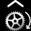
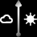
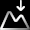

## List of default bitmaps of the ActiveLook companion application 

| ID | Name                       | Icon                                                                   |
|----|----------------------------|------------------------------------------------------------------------|
| 0  | `0_Battery_Icon30x15`      |       |
| 1  | `1_Elapsed_Time46x46`      |       |
| 2  | `2_Speed46x46`             |              |
| 3  | `3_Speed_Avg46x46`         |          |
| 4  | `4_Distance46x46`          |           |
| 5  | `5_Elevation_Gain46x46`    |     |
| 6  | `6_Pace46x46`              |               |
| 7  | `7_Heart_Beat46x46`        |         |
| 8  | `8_Altitude46x46`          |           |
| 9  | `9_Cadence_Avg46x46`       |        |
| 10 | `10_Heart_Beat_Avg46x46`   |    |
| 11 | `11_Power_Avg46x46`        |         |
| 12 | `12_Calories46x46`         |          |
| 13 | `13_Cadence46x46`          |           |
| 14 | `14_Power46x46`            |             |
| 15 | `15_Total_Descent46x46`    |     |
| 16 | `16_Energy_Exp46x46`       |        |
| 17 | `17_Ascent_Speed_Avg46x46` |  |
| 18 | `18_Cadence_Max46x46`      |       |
| 19 | `19_Heart_Beat_Max46x46`   |    |
| 20 | `20_Power_Max46x46`        |         |
| 21 | `21_Speed_Max46x46`        |         |
| 22 | `22_Ambient_Pressure46x46` |  |
| 23 | `23_Speed30x30`            |             |
| 24 | `24_Speed_Avg30x30`        |         |
| 25 | `25_Distance30x30`         |          |
| 26 | `26_Elevation_Gain30x30`   |    |
| 27 | `27_Pace30x30`             |              |
| 28 | `28_Heart_Beat30x30`       |        |
| 29 | `29_Altitude30x30`         |          |
| 30 | `30_Cadence_Avg30x30`      |       |
| 31 | `31_Heart_Beat_Avg30x30`   |    |
| 32 | `32_Power_Avg30x30`        |         |
| 33 | `33_Calories30x30`         |          |
| 34 | `34_Cadence30x30`          |           |
| 35 | `35_Power30x30`            |             |
| 36 | `36_Total_Descent30x30`    |     |
| 37 | `37_Energy_Exp30x30`       |        |
| 38 | `38_Ascent_Speed_Avg30x30` |  |
| 39 | `39_Cadence_Max30x30`      |       |
| 40 | `40_Heart_Beat_Max30x30`   |    |
| 41 | `41_Power_Max30x30`        |         |
| 42 | `42_Speed_Max30x30`        |         |
| 43 | `43_Ambient_Pressure30x30` |  |
| 44 | `44_Power_3S_Avg46x46`     |      |
| 45 | `45_Power_3S_Avg30x30`     |      |
| 46 | `46_Pace_Avg46x46`         |          |
| 47 | `47_Pace_Avg30x30`         |          |