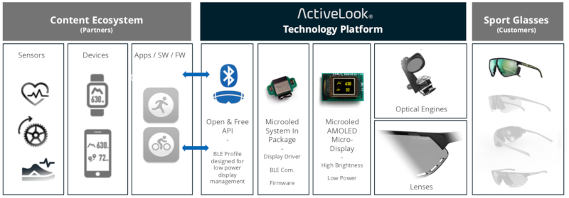

# ActiveLook® BLE Interface 

## What is ActiveLook®

ActiveLook® is a wireless micro display technology platform designed to be embedded in "regular" glasses and to provide key visual information to end users.

 

The unique combination of the ActiveLook® technology specificities (Extremely low weight, Compact form factor, See-through optics not blocking the field of view, Large autonomy) make it ideal for demanding sport activities.

All the ActiveLook displays can be controlled by an open and free wireless interface.

ActiveLook has been developed by [MICROOLED](https://www.microoled.net), a leading micro display manufacturer.

## Communication Interface Overview

ActiveLook® uses the wireless Bluetooth Low Energy technology in data communication between the controlling device (Master) and the ActiveLook® "connected" glasses (Slave).

Connection and access to an ActiveLook® device is easy as it follows the BLE implementation standards. The control of the ActiveLook® display is done via a custom BLE GATT Service (ActiveLook® Commands Interface) which has five GATT characteristics to transmit commands and receive data and notifications.

Most of the commands are very simple and allows you to draw a combination of basic shapes and to print text. However, in order to minimize the communication between the controlling device and the ActiveLook® glasses (speed, autonomy), there are also commands allowing the display and the management of preloaded graphical objects ( bitmaps, layouts, fonts, ... ).

## Content

[ActiveLook® Programming Interface Documentation](ActiveLook_API.md)

[Default Bitmaps](ActiveLook_Default_Bitmaps.md)

## Reach Us

We love feedback. Don't hesitate to open a Github issue or feel free to reach us at contact@activelook.net 
